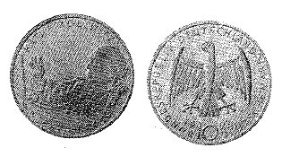

# Bekanntmachung über die Ausprägung von Bundesmünzen im Nennwert von 10 Deutschen Mark (Gedenkmünze 125. Geburtstag von Käthe Kollwitz) (Münz10DMBek 1992)

Ausfertigungsdatum
:   1992-06-04

Fundstelle
:   BGBl I: 1992, 1028

## (XXXX)

(1) Auf Grund des § 6 des Gesetzes über die Ausprägung von
Scheidemünzen in der im Bundesgesetzblatt Teil III, Gliederungsnummer
690-1, veröffentlichten bereinigten Fassung hat die Bundesregierung
beschlossen, zum 125. Geburtstag von Käthe Kollwitz eine Bundesmünze
(Gedenkmünze) im Nennwert von 10 Deutschen Mark prägen zu lassen. Die
Auflage der Münze beträgt 8,45 Millionen Stück. Die Prägung erfolgt in
der Staatlichen Münze Karlsruhe.

(2) Die Münze wird ab 3. Juli 1992 in den Verkehr gebracht.

(3) Die Münze besteht aus einer Legierung von 625 Tausendteilen Silber
und 375 Tausendteilen Kupfer. Sie hat einen Durchmesser von 32,5
Millimetern und ein Gewicht von 15,5 Gramm.

(4) Das Gepräge auf beiden Seiten ist erhaben und wird von einem
schützenden glatten Randstab umgeben.

(5) Die Bildseite zeigt ein Selbstportrait von Käthe Kollwitz am
Zeichenbrett aus einer Kohlezeichnung der Künstlerin von 1933. Die
Umschrift lautet:

*
    *
        *
            *
                *   "KÄTHE KOLLWITZ

                    \* 1867 . 1945 +".

(6) Die Wertseite trägt einen Adler, die Jahreszahl 1992, das
Münzzeichen "G" der Staatlichen Münze Karlsruhe und die Umschrift:

*
    *
        *
            *   "BUNDESREPUBLIK DEUTSCHLAND

                *   10 DEUTSCHE MARK".

(7) Die Jahreszahl "1992" und das Münzzeichen "G" sind Teil der
Umschrift. Das Münzzeichen befindet sich zwischen der Zahl 10 und der
Adlerabbildung.

(8) Der glatte Münzrand enthält in vertiefter Prägung die Inschrift:

*
    *
        *   "ICH WILL WIRKEN IN DIESER ZEIT".

(9) Zwischen Ende und Anfang der Randschrift befinden sich drei
fünfzackige Sterne.

(10) Der Entwurf der Münze stammt von Reinhart Heinsdorff, Friedberg-
Ottmaring.
Der Bundesminister der Finanzen

## (XXXX) Abbildung der Münze

(Fundstelle: BGBl. I 1992, 1028)

