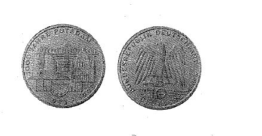

# Bekanntmachung über die Ausprägung von Bundesmünzen im Nennwert von 10 Deutschen Mark (Gedenkmünze 1000 Jahre Potsdam) (Münz10DMBek 1993-05)

Ausfertigungsdatum
:   1993-04-19

Fundstelle
:   BGBl I: 1993, 687

## (XXXX)

Auf Grund des § 6 des Gesetzes über die Ausprägung von Scheidemünzen
in der im Bundesgesetzblatt Teil III, Gliederungsnummer 690-1,
veröffentlichten bereinigten Fassung hat die Bundesregierung
beschlossen, aus Anlaß der 1000-Jahr-Feier der Stadt Potsdam eine
Bundesmünze (Gedenkmünze) im Nennwert von 10 Deutschen Mark prägen zu
lassen. Die Auflage der Münze beträgt 7,95 Millionen Stück. Die
Prägung erfolgt in der Staatlichen Münze Stuttgart.
Die Münze wird ab 16. Juni 1993 in den Verkehr gebracht.
Die Münze besteht aus einer Legierung von 625 Tausendteilen Silber und
375 Tausendteilen Kupfer. Sie hat einen Durchmesser von 32,5
Millimetern und ein Gewicht von 15,5 Gramm.
Das Gepräge auf beiden Seiten ist erhaben und wird von einem
schützenden glatten Randstab umgeben.
Die Bildseite zeigt die geschichtliche Entwicklung der Stadt Potsdam
bis zur Gegenwart durch Architekturzitate. Die Umschrift lautet:

*
    *
        *
            *   "1000 JAHRE POTSDAM

                *   993 - 1993".

Die Wertseite trägt einen Adler, die Jahreszahl "1993", das
Münzzeichen "F" der Staatlichen Münze Stuttgart und die Umschrift:

*
    *
        *
            *   "BUNDESREPUBLIK DEUTSCHLAND

                *   10 DEUTSCHE MARK".

Die Jahreszahl "1993" und das Münzzeichen "F" befinden sich im Feld
zwischen Adlerfängen und Umschrift.
Der glatte Münzrand enthält in vertiefter Prägung die Inschrift:
"DAS GANZE EILAND MUSS EIN PARADIES WERDEN".
Zwischen Ende und Anfang der Randschrift ist ein fünfzackiger Stern
eingeprägt.
Der Entwurf der Münze stammt von Erich Ott, München.

## (XXXX) Abbildung der Münze

(Fundstelle: BGBl. I 1993, 678)

