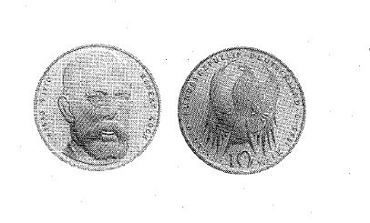

# Bekanntmachung über die Ausprägung von Bundesmünzen im Nennwert von 10 Deutschen Mark (Gedenkmünze 150. Geburtstag von Robert Koch) (Münz10DMBek 1993-09)

Ausfertigungsdatum
:   1993-09-03

Fundstelle
:   BGBl I: 1994, 88

## (XXXX)

Auf Grund des § 6 des Gesetzes über die Ausprägung von Scheidemünzen
in der im Bundesgesetzblatt Teil III, Gliederungsnummer 690-1,
veröffentlichten bereinigten Fassung hat die Bundesregierung
beschlossen, zum 150. Geburtstag von Robert Koch eine Bundesmünze
(Gedenkmünze) im Nennwert von 10 Deutschen Mark prägen zu lassen. Die
Auflage der Münze beträgt 7,45 Millionen Stück. Die Prägung erfolgt in
der Hamburgischen Münze.
Die Münze wird ab 9. Februar 1994 in den Verkehr gebracht.
Die Münze besteht aus einer Legierung von 625 Tausendteilen Silber und
375 Tausendteilen Kupfer. Sie hat einen Durchmesser von 32,5
Millimetern und ein Gewicht von 15,5 Gramm.
Das Gepräge auf beiden Seiten ist erhaben und wird von einem
schützenden glatten Randstab umgeben.
Die Bildseite zeigt das Portrait Robert Kochs in der für sein Schaffen
entscheidenden Lebensphase. Die Umschrift lautet:

*
    *
        *   "ROBERT KOCH \* 1843 + 1910".

Die Wertseite trägt einen Adler, die Jahreszahl 1993, das Münzzeichen
"J" der Hamburgischen Münze und die Umschrift:

*
    *
        *   "BUNDESREPUBLIK DEUTSCHLAND

            *   10 DEUTSCHE MARK".

Die Jahreszahl 1993 und das Münzzeichen "J" sind Teil der Umschrift.
Der glatte Münzrand enthält in vertiefter Prägung die Inschrift:

*
    *
        *   "MITBEGRUENDER DER BAKTERIOLOGIE".

Zwischen Ende und Anfang der Randschrift befindet sich ein zweifaches
Eichenblatt nebst zwei Eicheln.
Der Entwurf der Münze stammt von Hubert Klinkel, Würzburg.

## (XXXX)

(Fundstelle: BGBl. I 1994, 88)

