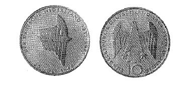

# Bekanntmachung über die Ausprägung von Bundesmünzen im Nennwert von 10 Deutschen Mark (Gedenkmünze 50. Jahrestag des 20. Juli 1944) (Münz10DMBek 1994-02)

Ausfertigungsdatum
:   1994-02-25

Fundstelle
:   BGBl I: 1994, 1008

## (XXXX)

Auf Grund des § 6 des Gesetzes über die Ausprägung von Scheidemünzen
in der im Bundesgesetzblatt Teil III, Gliederungsnummer 690-1,
veröffentlichten bereinigten Fassung hat die Bundesregierung
beschlossen, zum 50. Jahrestag des 20. Juli 1944 eine Bundesmünze
(Gedenkmünze) im Nennwert von 10 Deutschen Mark prägen zu lassen. Die
Auflage der Münze beträgt 7,45 Millionen Stück. Die Prägung erfolgt in
der Staatlichen Münze Berlin.
Die Münze wird ab 6. Juli 1994 in den Verkehr gebracht.
Die Münze besteht aus einer Legierung von 625 Tausendteilen Silber und
375 Tausendteilen Kupfer. Sie hat einen Durchmesser von 32,5
Millimetern und ein Gewicht von 15,5 Gramm.
Das Gepräge auf beiden Seiten ist erhaben und wird von einem
schützenden glatten Randstab umgeben.
Die Bildseite zeigt einen Adlerflügel, der von einer eisernen Kette
beschwert ist.

Die Umschrift lautet: "DER DEUTSCHE WIDERSTAND 1933 - 1945

    *
        *   20. Juli 1944".

Die Wertseite trägt einen Adler, die Jahreszahl 1994, das Münzzeichen
"A" der Staatlichen Münze Berlin und die Umschrift:

*
    *   "BUNDESREPUBLIK DEUTSCHLAND

        *   10 DEUTSCHE MARK".

Die Jahreszahl 1994 ist Teil der Umschrift. Das Münzzeichen "A"
befindet sich unterhalb vom linken Fang des Adlers.
Der glatte Münzrand enthält in vertiefter Prägung die Inschrift:
"WIDERSTAND GEGEN DEN NATIONALSOZIALISMUS".
Zwischen Ende und Anfang der Randschrift befindet sich ein Punkt. Der
Entwurf der Münze stammt von Paul Effert, Kaarst.

## (XXXX) Abbildung der Münze

(Fundstelle: BGBl. I 1994, 1008)

