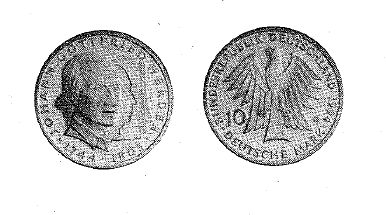

# Bekanntmachung über die Ausprägung von Bundesmünzen im Nennwert von 10 Deutschen Mark (Gedenkmünze 250. Geburtstag von Johann Gottfried Herder) (Münz10DMBek 1994-10)

Ausfertigungsdatum
:   1994-09-14

Fundstelle
:   BGBl I: 1994, 2853

## (XXXX)

Auf Grund des § 6 des Gesetzes über die Ausprägung von Scheidemünzen
in der im Bundesgesetzblatt Teil III, Gliederungsnummer 690-1,
veröffentlichten bereinigten Fassung hat die Bundesregierung
beschlossen, zum 250. Geburtstag von Johann Gottfried Herder eine
Bundesmünze (Gedenkmünze) im Nennwert von 10 Deutschen Mark prägen zu
lassen. Die Auflage der Münze beträgt 7,45 Millionen Stück. Die
Prägung erfolgt in der Staatlichen Münze Karlsruhe.
Die Münze wird ab 15. November 1994 in den Verkehr gebracht.
Die Münze besteht aus einer Legierung von 625 Tausendteilen Silber und
375 Tausendteilen Kupfer. Sie hat einen Durchmesser von 32,5
Millimetern und ein Gewicht von 15,5 Gramm.
Das Gepräge auf beiden Seiten ist erhaben und wird von einem
schützenden glatten Randstab umgeben.
Die Bildseite zeigt eine Darstellung der Person Herders mit Textseiten
als Symbol seines Schaffens im Hintergrund. Die Umschrift lautet:

*
    *   "JOHANN GOTTFRIED HERDER

        *   . 1744 - 1803 .".

Die Wertseite trägt einen Adler, die Wertzahl "10", das Münzzeichen
"G" der Staatlichen Münze Karlsruhe und die Umschrift:

*   ". BUNDESREPUBLIK DEUTSCHLAND 1994 .

    *
        *   DEUTSCHE MARK".

Die Wertzahl "10" befindet sich neben dem rechten und das Münzzeichen
"G" neben dem linken Flügel des Adlers.
Der glatte Münzrand enthält in vertiefter Prägung die Inschrift:

*
    *   "HUMANITÄT IST DER ZWECK DER

        *   MENSCHENNATUR".

Zwischen Ende und Anfang der Randschrift befindet sich eine liegende
Raute. Der Entwurf der Münze stammt von Wolfgang Th. Doehm, Stuttgart.

Der Bundesminister der Finanzen

## (XXXX)

(Fundstelle: BGBl. I 1994, 2853)

