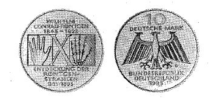

# Bekanntmachung über die Ausprägung von Bundesmünzen im Nennwert von 10 Deutschen Mark (Gedenkmünze 150. Geburtstag von Wilhelm Conrad Röntgen und 100. Jahrestag der Entdeckung der Röntgenstrahlen) (Münz10DMBek 1995-07)

Ausfertigungsdatum
:   1995-07-06

Fundstelle
:   BGBl I: 1995, 1072

## (XXXX)

Auf Grund des § 6 des Gesetzes über die Ausprägung von Scheidemünzen
in der im Bundesgesetzblatt Teil III, Gliederungsnummer 690-1,
veröffentlichten bereinigten Fassung hat die Bundesregierung
beschlossen, zum 150. Geburtstag von Wilhelm Conrad Röntgen und
zugleich zum 100. Jahrestag der Entdeckung der Röntgenstrahlen eine
Bundesmünze (Gedenkmünze) im Nennwert von 10 Deutschen Mark prägen zu
lassen. Die Auflage der Münze beträgt 6,9 Millionen Stück. Die Prägung
erfolgt im Bayerischen Hauptmünzamt, München.
Die Münze wird ab 13. September 1995 in den Verkehr gebracht.
Die Münze besteht aus einer Legierung von 625 Tausendteilen Silber und
375 Tausendteilen Kupfer. Sie hat einen Durchmesser von 32,5
Millimetern und ein Gewicht von 15,5 Gramm.
Das Gepräge auf beiden Seiten ist erhaben und wird von einem
schützenden glatten Randstab umgeben.
Die Bildseite zeigt die Abbildung der Hand als Aufsicht und als
schematische Röntgenaufnahme. Die Aufschrift lautet:
"WILHELM CONRAD RÖNTGEN 1845 - 1923
ENTDECKUNG DER RÖNTGENSTRAHLEN 8.11.1895".
Die Wertseite trägt einen Adler, die Jahreszahl 1995, das Münzzeichen
"D" des Bayerischen Hauptmünzamtes und die Aufschrift:
"10 DEUTSCHE MARK
BUNDESREPUBLIK DEUTSCHLAND".
Das Münzzeichen "D" befindet sich im Feld neben dem linken Adlerfang.
Der glatte Münzrand enthält in vertiefter Prägung die Inschrift:
"ERSTER NOBELPREIS FUER PHYSIK 1901".
Zwischen Ende und Anfang der Randschrift befindet sich eine liegende
Raute.
Der Entwurf der Münze stammt von Claus und Ursula Homfeld, Bremen.

Der Bundesminister der Finanzen

## (XXXX) Abbildung der Münze

(Fundstelle: BGBl. I 1995, 1072)

