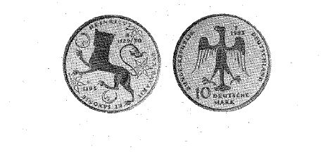

# Bekanntmachung über die Ausprägung von Bundesmünzen im Nennwert von 10 Deutschen Mark (Gedenkmünze 800. Todestag Heinrichs des Löwen) (Münz10DMBek 1995-10)

Ausfertigungsdatum
:   1995-10-23

Fundstelle
:   BGBl I: 1995, 1512

## (XXXX)

Auf Grund des § 6 des Gesetzes über die Ausprägung von Scheidemünzen
in der im Bundesgesetzblatt Teil III, Gliederungsnummer 690-1,
veröffentlichten bereinigten Fassung hat die Bundesregierung
beschlossen, zum 800. Todestag Heinrichs des Löwen eine Bundesmünze
(Gedenkmünze) im Nennwert von 10 Deutschen Mark prägen zu lassen. Die
Auflage der Münze beträgt 6,9 Millionen Stück. Die Prägung erfolgt in
der Staatlichen Münze Stuttgart.
Die Münze wird ab 5. Dezember 1995 in den Verkehr gebracht.
Die Münze besteht aus einer Legierung von 625 Tausendteilen Silber und
375 Tausendteilen Kupfer. Sie hat einen Durchmesser von 32,5
Millimetern und ein Gewicht von 15,5 Gramm.
Das Gepräge auf beiden Seiten ist erhaben und wird von einem
schützenden glatten Randstab umgeben.
Die Bildseite zeigt den welfischen Löwen als Wappenzeichen Heinrichs,
Sonne und Mond als Symbole christlichen Herrschaftsanspruchs, das
Geburts- und Todesjahr

*
    *
        *
            *
                *   "1129/30 +1195"

und die Umschrift

*
    *
        *
            *
                *   "HEINRICVS DVX BAVARIE ET SAXONIE".

Die Wertseite zeigt einen Adler, die Jahreszahl "1995", das
Münzzeichen "F" der Staatlichen Münze Stuttgart, die Aufschrift

*
    *
        *
            *
                *   "10 DEUTSCHE MARK"

und die Umschrift

*
    *
        *
            *
                *   "BUNDESREPUBLIK DEUTSCHLAND".

Das Münzzeichen und die Jahreszahl befinden sich oberhalb des linken
Adlerflügels.
Der glatte Münzrand enthält in vertiefter Prägung die Inschrift:

*
    *
        *
            *
                *   "HEINRICH DER LOEWE

                    AUS KAISERLICHEM STAMM".

Zwischen Ende und Anfang der Randschrift und zwischen den Worten
"LOEWE" und "AUS" befindet sich je eine Löwenfigur.
Der Entwurf der Münze stammt von Hubert Klinkel, Würzburg.

Der Bundesminister der Finanzen

## (XXXX)

(Fundstelle: BGBl. I 1995, 1512)

