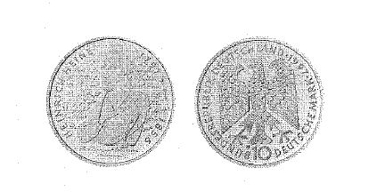

# Bekanntmachung über die Ausprägung von Bundesmünzen im Nennwert von 10 Deutschen Mark (Gedenkmünze 200. Geburtstag von Heinrich Heine) (Münz10DMBek 1997-10)

Ausfertigungsdatum
:   1997-10-14

Fundstelle
:   BGBl I: 1997, 2609

## (XXXX)

Auf Grund des § 6 des Gesetzes über die Ausprägung von Scheidemünzen
in der im Bundesgesetzblatt Teil III, Gliederungsnummer 690-1,
veröffentlichten bereinigten Fassung hat die Bundesregierung
beschlossen, zum "200. Geburtstag von Heinrich Heine" eine Bundesmünze
(Gedenkmünze) im Nennwert von 10 Deutschen Mark prägen zu lassen.
Die Auflage der Münze beträgt 3,75 Millionen Stück, darunter 750 000
Stück in Spiegelglanz. Die Prägung in Normalausführung (Stempelglanz)
erfolgt im Bayerischen Hauptmünzamt in München. Die Herstellung in
Spiegelglanz wird von allen fünf deutschen Münzämtern zu gleichen
Teilen realisiert.
Die Münze wird ab 6. November 1997 in den Verkehr gebracht. Sie
besteht aus einer Legierung von 625 Tausendteilen Silber und 375
Tausendteilen Kupfer, hat einen Durchmesser von 32,5 Millimetern und
eine Masse (Gewicht) von 15,5 Gramm. Das Gepräge auf beiden Seiten ist
erhaben und wird von einem schützenden glatten Randstab umgeben.
Die Bildseite zeigt Heinrich Heine nach einer Vorlage von Wilhelm
Hensel aus dem Jahre 1829. Die Umschrift lautet:

*
    *
        *
            *   "HEINRICH HEINE

                * 1797 + 1856".

Die Wertseite trägt einen Adler, die Jahreszahl "1997", das
Münzzeichen "D" des Bayerischen Hauptmünzamtes und die Umschrift:

*
    *
        *   "BUNDESREPUBLIK DEUTSCHLAND

            *   10 DEUTSCHE MARK".

Bei den Münzen in der Qualität Spiegelglanz erscheinen die Münzzeichen
"A", "D", "F", "G" und "J".
Der glatte Münzrand enthält in vertiefter Prägung die Inschrift:
"DEUTSCHLAND - DAS SIND WIR SELBER - 1833".
Der Entwurf der Münze stammt von Reinhart Heinsdorff, Friedberg.

## (XXXX)

(Fundstelle: BGBl. I 1997, 2609)

