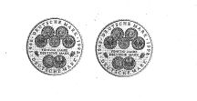

# Bekanntmachung über die Ausprägung von Bundesmünzen im Nennwert von 10 Deutschen Mark (Gedenkmünze "50 Jahre DM") (Münz10DMBek 1998-05)

Ausfertigungsdatum
:   1998-05-28

Fundstelle
:   BGBl I: 1998, 1237 (1288)

## (XXXX)

Auf Grund des § 6 des Gesetzes über die Ausprägung von Scheidemünzen
in der im Bundesgesetzblatt Teil III, Gliederungsnummer 690-1,
veröffentlichten bereinigten Fassung hat die Bundesregierung
beschlossen, anläßlich des Jubiläums "50 Jahre DM" eine Bundesmünze
(Gedenkmünze) im Nennwert von 10 Deutschen Mark prägen zu lassen.
Die Auflage der Münze beträgt 4,5 Millionen Stück, darunter 1,0
Millionen Stück in Spiegelglanz. Die Prägung in Normalausführung
(Stempelglanz) erfolgt in der Prägestätte Stuttgart der Staatlichen
Münzen Baden-Württemberg. Die Herstellung in Spiegelglanz wird von
allen fünf deutschen Münzämtern zu gleichen Teilen realisiert.
Die Münze wird ab 19. Juni 1998 in den Verkehr gebracht. Sie besteht
aus einer Legierung von 925 Tausendteilen Silber und 75 Tausendteilen
Kupfer, hat einen Durchmesser von 32,5 Millimetern und eine Masse
(Gewicht) von 15,5 Gramm. Das Gepräge auf beiden Seiten ist erhaben
und wird von einem schützenden glatten Randstab umgeben.
Die Bildseite zeigt die Vorder- und Rückseiten der 1-, 2- und 5-DM-
Münzen.
Die Umschrift lautet:

*
    *   "1948 . DEUTSCHE MARK . 1998".

Sie wird, durch die in den Abschnitt gestellte Inschrift

*
    *   "FÜNFZIG JAHRE DEUTSCHE MARK"

begrenzt, von Eichenlaub ergänzt.
Die Wertseite trägt einen Adler, das Münzzeichen "F" der Staatlichen
Münze Stuttgart, die Umschrift

*
    *   "BUNDESREPUBLIK DEUTSCHLAND"

und die in den Abschnitt gestellte Inschrift

*
    *   "10 DEUTSCHE MARK".

Bei den Münzen in der Qualität Spiegelglanz erscheinen die Münzzeichen
"A", "D", "F", "G" und "J".
Der glatte Münzrand enthält in vertiefter Prägung die Inschrift:

*
    *   "EINIGKEIT UND RECHT UND FREIHEIT".

Der Entwurf der Münze stammt von Herrn Ulrich von Chrzanowski, Berlin,
und Herrn Dr. Heinrich Schlüter, Bonn.

Der Bundesminister der Finanzen

## (XXXX)

(Fundstelle: BGBl. I 1998, 1237)

