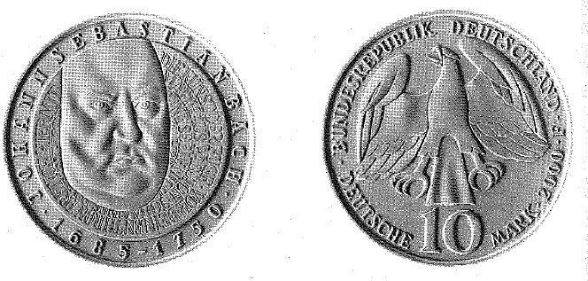

# Bekanntmachung über die Ausprägung von Bundesmünzen im Nennwert von 10 Deutschen Mark (Gedenkmünze "250. Todestag Johann Sebastian Bach") (Münz10DMBek 2000)

Ausfertigungsdatum
:   2000-05-25

Fundstelle
:   BGBl I: 2000, 790

## (XXXX)

Auf Grund des § 6 des Gesetzes über die Ausprägung von Scheidemünzen
in der im Bundesgesetzblatt Teil III, Gliederungsnummer 690-1,
veröffentlichten bereinigten Fassung hat die Bundesregierung
beschlossen, zum Thema "250. Todestag Johann Sebastian Bach" eine
Bundesmünze (Gedenkmünze) im Nennwert von 10 Deutschen Mark prägen zu
lassen.
Die Auflage der Münze beträgt 3,8 Millionen Stück, darunter 0,8
Millionen Stück in Spiegelglanz. Die Prägung in Normalausführung
erfolgt durch die Staatlichen Münzen Baden-Württemberg, Prägestätte
Stuttgart. Die Herstellung in Spiegelglanz wird von allen fünf
deutschen Münzämtern zu gleichen Teilen realisiert. Die Münze wird ab
dem 13. Juli 2000 in den Verkehr gebracht. Sie besteht aus einer
Legierung von 925 Tausendteilen Silber und 75 Tausendteilen Kupfer,
hat einen Durchmesser von 32,5 Millimetern und eine Masse (Gewicht)
von 15,5 Gramm. Das Gepräge auf beiden Seiten ist erhaben und wird von
einem schützenden, glatten Randstab umgeben.
Die Bildseite bestimmt ein Porträt, das sich an das berühmte und als
authentisch betrachtete Gemälde Elias Gottlob Haußmanns anlehnt. Es
hebt sich aus einer Buchstabenstruktur der Titel letzter Werke Bachs
hervor. Das Bildnis ist umrahmt von einer klaren und abgesetzten
Umschrift des Namens und der Lebensdaten.
Die Wertseite trägt einen Adler, die Jahreszahl 2000, das Münzzeichen
"F" der Prägestätte Stuttgart und die Umschrift:

*
    *   "BUNDESREPUBLIK DEUTSCHLAND

        *   10 DEUTSCHE MARK".

Bei den Münzen in der Qualität Spiegelglanz erscheinen die Münzzeichen
"A", "D", "F", "G" und "J".
Der glatte Münzrand enthält in vertiefter Prägung die Inschrift:
"250. TODESTAG JOHANN SEBASTIAN BACH".
Der Entwurf der Münze stammt von Frau Aase Thorsen, Neuberg.

Der Bundesminister der Finanzen

## (XXXX) Darstellung der Münze

(Fundstelle: BGBl. I 2000, 790)

