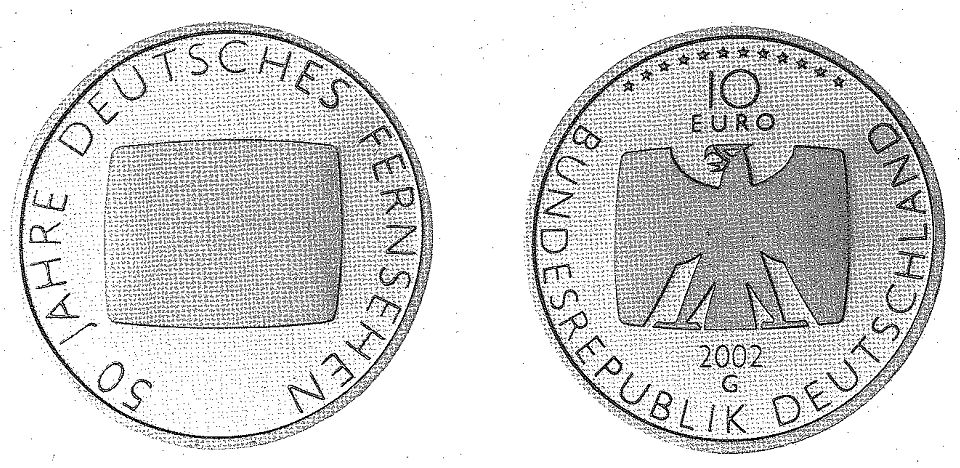

# Bekanntmachung über die Ausprägung von deutschen Euro-Gedenkmünzen im Nennwert von 10 Euro (Gedenkmünze "50 Jahre Deutsches Fernsehen") (Münz10EuroBek 2002-10)

Ausfertigungsdatum
:   2002-09-25

Fundstelle
:   BGBl I: 2002, 3861

## (XXXX)

Gemäß den §§ 2, 4 und 5 des Münzgesetzes vom 16. Dezember 1999 (BGBl.
I S. 2402) hat die Bundesregierung beschlossen, zum Thema "50 Jahre
Deutsches Fernsehen" eine deutsche Euro-Gedenkmünze im Nennwert von 10
Euro prägen zu lassen.
Die Auflage der Münze beträgt 2.290.000 Stück, darunter 290.000 Stück
in Spiegelglanzausführung. Die Prägung erfolgt durch die Staatlichen
Münzen Baden-Württemberg, Prägestätte Karlsruhe. Die Münze wird ab dem
7\. November 2002 in den Verkehr gebracht. Sie besteht aus einer
Legierung von 925 Tausendteilen Silber und 75 Tausendteilen Kupfer,
hat einen Durchmesser von 32,5 Millimetern und eine Masse von 18
Gramm. Das Gepräge auf beiden Seiten ist erhaben und wird von einem
schützenden, glatten Randstab umgeben.
Die Bildseite zeigt einen Fernsehbildschirm, der das Thema durch
äußerste Reduktion mit größter Plausibilität umsetzt. Die optische
Hervorhebung des Bildschirms bewirkt einen unmittelbaren hohen
Wiedererkennungswert, der zugleich Symbolwert ist. Das Motiv wird von
der Umschrift "50 JAHRE DEUTSCHES FERNSEHEN" kreisförmig umrahmt.
Die Wertseite trägt einen Adler, zwölf Sterne, den Nennwert "10 EURO",
die Umschrift "BUNDESREPUBLIK DEUTSCHLAND", die Jahreszahl 2002 und
das Münzzeichen "G" der Staatlichen Münzen Baden-Württemberg,
Prägestätte Karlsruhe.
Der glatte Münzrand enthält in vertiefter Prägung die Inschrift:

*   "INFORMATION BILDUNG UNTERHALTUNG "

Der Entwurf der Münze stammt von Jordi Regel, Berlin.

## Schlussformel

Der Bundesminister der Finanzen

## (XXXX)

(Fundstelle: BGBl. I 2002, 3861)

