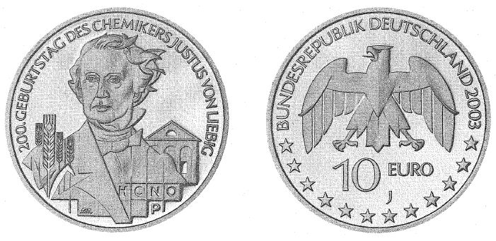

# Bekanntmachung über die Ausprägung von deutschen Euro-Gedenkmünzen im Nennwert von 10 Euro (Gedenkmünze "200. Geburtstag des Chemikers Justus von Liebig") (Münz10EuroBek 2003-03)

Ausfertigungsdatum
:   2003-03-13

Fundstelle
:   BGBl I: 2003, 403

## (XXXX)

Gemäß den §§ 2, 4 und 5 des Münzgesetzes vom 16. Dezember 1999 (BGBl.
I S. 2402) hat die Bundesregierung beschlossen, zum Thema "200.
Geburtstag des Chemikers Justus von Liebig" eine deutsche Euro-
Gedenkmünze im Nennwert von 10 Euro prägen zu lassen.
Die Auflage der Münze beträgt 2400000 Stück, darunter 350000 Stück in
Spiegelglanzausführung. Die Prägung erfolgt durch die Hamburgische
Münze. Die Münze wird ab dem 8. Mai 2003 in den Verkehr gebracht. Sie
besteht aus einer Legierung von 925 Tausendteilen Silber und 75
Tausendteilen Kupfer, hat einen Durchmesser von 32,5 Millimetern und
eine Masse von 18 Gramm. Das Gepräge auf beiden Seiten ist erhaben und
wird von einem schützenden, glatten Randstab umgeben.
Die Bildseite kombiniert in besonders gelungener Weise ein
einprägsames Portrait Liebigs mit den Symbolen seiner wichtigsten
Leistungen. Die Ähren stehen für Liebig als Begründer der
Agrikulturchemie, das Laboratoriumsgebäude symbolisiert das durch ihn
eingeführte Lernen durch Forschung und der Ausschnitt aus dem
Periodensystem der Elemente würdigt Liebigs revolutionären Beitrag zur
Analytik organischer Stoffe.
Die Wertseite harmoniert in ihrer Klarheit und Prägnanz mit der klar
strukturierten Bildseite. Wertziffer, Adler, Jahreszahl, Münzzeichen
("J") und der Schriftzug "Bundesrepublik Deutschland" bilden eine
ausgewogene Komposition, die durch die zwölf Europasterne ergänzt
wird.
Der glatte Münzrand enthält in vertiefter Prägung die Inschrift:
"FORSCHEN () LEHREN () ANWENDEN () ()".
Der Entwurf der Münze stammt von Bodo Broschat, Berlin.

## Schlussformel

Der Bundesminister der Finanzen

## (XXXX)

(Fundstelle: BGBl. I 2003, 403)

