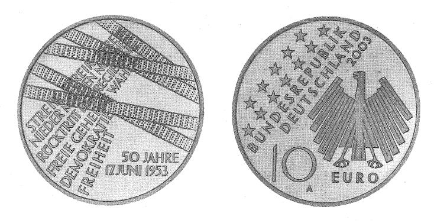

# Bekanntmachung über die Ausprägung von deutschen Euro-Gedenkmünzen im Nennwert von 10 Euro (Gedenkmünze "50 Jahre Volksaufstand 17. Juni 1953") (Münz10EuroBek 2003-04)

Ausfertigungsdatum
:   2003-04-27

Fundstelle
:   BGBl I: 2003, 650

## (XXXX)

Gemäß den §§ 2, 4 und 5 des Münzgesetzes vom 16. Dezember 1999 (BGBl.
I S. 2402) hat die Bundesregierung beschlossen, zum Thema "50 Jahre
Volksaufstand 17. Juni 1953" eine deutsche Euro-Gedenkmünze im
Nennwert von 10 Euro prägen zu lassen.
Die Auflage der Münze beträgt 2.400.000 Stück, darunter 350.000 Stück
in Spiegelglanzausführung. Die Prägung erfolgt durch die Staatliche
Münze Berlin. Die Münze wird ab dem 12. Juni 2003 in den Verkehr
gebracht. Sie besteht aus einer Legierung von 925 Tausendteilen Silber
und 75 Tausendteilen Kupfer, hat einen Durchmesser von 32,5
Millimetern und eine Masse von 18 Gramm. Das Gepräge auf beiden Seiten
ist erhaben und wird von einem schützenden, glatten Randstab umgeben.
Die Bildseite erinnert mit den dargestellten stilisierten Panzerketten
an die gewaltsame Niederschlagung des Volksaufstandes am 17. Juni 1953
in der DDR. Die dargestellten Begriffe "STREIK", "NIEDER MIT DEN
NORMEN", "RÜCKTRITT DER REGIERUNG", "FREIE GEHEIME WAHLEN",
"DEMOKRATIE" und "FREIHEIT" erinnern an Ablauf und Steigerung des
Volksaufstandes sowie an die erhobenen Forderungen.
Die Wertseite trägt einen Adler, zwölf Sterne, den Nennwert "10 EURO",
die Aufschrift "BUNDESREPUBLIK DEUTSCHLAND", die Jahreszahl 2003 und
das Münzzeichen "A" der Staatlichen Münze Berlin.
Der glatte Münzrand enthält in vertiefter Prägung die Inschrift:
"ERINNERUNG AN DEN VOLKSAUFSTAND IN DER DDR
<>".
Der Entwurf der Münze stammt von Hans Joa Dobler, Ehekirchen.

## Schlussformel

Der Bundesminister der Finanzen

## (XXXX)

(Fundstelle: BGBl. I 2003, 650)

