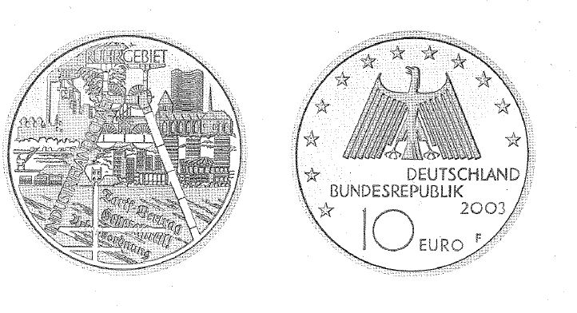

# Bekanntmachung über die Ausprägung von deutschen Euro-Gedenkmünzen im Nennwert von 10 Euro (Gedenkmünze "Industrielandschaft Ruhrgebiet") (Münz10EuroBek 2003-05-27)

Ausfertigungsdatum
:   2003-05-27

Fundstelle
:   BGBl I: 2003, 785

## (XXXX)

Gemäß den §§ 2, 4 und 5 des Münzgesetzes vom 16. Dezember 1999 (BGBl.
I S. 2402) hat die Bundesregierung beschlossen, zum Thema
"Industrielandschaft Ruhrgebiet" eine deutsche Euro-Gedenkmünze im
Nennwert von 10 Euro prägen zu lassen.
Die Auflage der Münze beträgt 2400.000 Stück, darunter 350.000 Stück
in Spiegelglanzausführung. Die Prägung erfolgt durch die Staatlichen
Münzen Baden-Württemberg, Prägestätte Stuttgart. Die Münze wird ab dem
10\. Juli 2003 in den Verkehr gebracht. Sie besteht aus einer Legierung
von 925 Tausendteilen Silber und 75 Tausendteilen Kupfer, hat einen
Durchmesser von 32,5 Millimetern und eine Masse von 18 Gramm. Das
Gepräge auf beiden Seiten ist erhaben und wird von einem schützenden,
glatten Randstab umgeben.
Die Bildseite stellt die Geschichte und Gegenwart des Ruhrgebiets in
seiner Vielfalt symbolisch dar. Der Entwurf würdigt die montan-
industrielle Prägung des Reviers, deutet aber gleichzeitig die moderne
Entwicklung zur Hochschul- und Wissenschaftslandschaft sowie zur
Dienstleistungsregion an. Die gewählte Darstellung des Themas bezieht
mit den Worten "Tarifvertrag, Generalstreik und Arbeitsordnung" auch
die sozialpolitische Dimension mit ein.
Die Wertseite trägt einen Adler, zwölf Sterne, den Nennwert "10 EURO",
die Aufschrift "BUNDESREPUBLIK DEUTSCHLAND", die Jahreszahl 2003 und
das Münzzeichen "F" der Staatlichen Münzen Baden-Württemberg,
Prägestätte Stuttgart.
Der glatte Münzrand enthält in vertiefter Prägung die Inschrift:
"RUHRPOTT
KULTURLANDSCHAFT".
Der Entwurf der Münze stammt von Hans Joa Dobler, Ehekirchen.

## Schlussformel

Der Bundesminister der Finanzen

## (XXXX)

(Fundstelle: BGBl. I 2003, 785)

