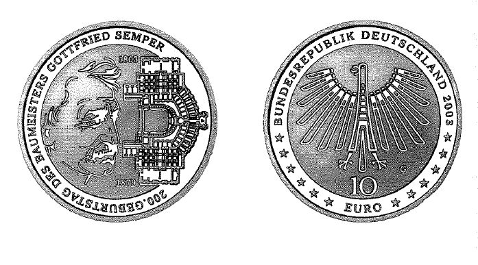

# Bekanntmachung über die Ausprägung von deutschen Euro-Gedenkmünzen im Nennwert von 10 Euro (Gedenkmünze "200. Geburtstag des Baumeisters Gottfried Semper") (Münz10EuroBek 2003-09-08)

Ausfertigungsdatum
:   2003-09-08

Fundstelle
:   BGBl I: 2003, 1898

## (XXXX)

Gemäß den §§ 2, 4 und 5 des Münzgesetzes vom 16. Dezember 1999 (BGBl.
I S. 2402) hat die Bundesregierung beschlossen, zum 200. Geburtstag
des Baumeisters Gottfried Semper eine deutsche Euro-Gedenkmünze im
Nennwert von 10 Euro prägen zu lassen.
Die Auflage der Münze beträgt 2.400.000 Stück, darunter 350.000 Stück
in Spiegelglanzausführung. Die Prägung erfolgt durch die Staatlichen
Münzen Baden-Württemberg, Prägestätte Karlsruhe. Die Münze wird ab dem
13\. November 2003 in den Verkehr gebracht. Sie besteht aus einer
Legierung von 925 Tausendteilen Silber und 75 Tausendteilen Kupfer,
hat einen Durchmesser von 32,5 Millimetern und eine Masse von 18
Gramm. Das Gepräge auf beiden Seiten ist erhaben und wird von einem
schützenden, glatten Randstab umgeben.
Die Bildseite kombiniert ein markantes Porträt des Baumeisters und
Theoretikers Gottfried Semper mit der Darstellung eines
Teilgrundrisses des zweiten Dresdner Hoftheaters (der heutigen
Semperoper), eines seiner bedeutendsten Werke. Der Entwurf zeichnet
sich durch seine kompositorische Ausgewogenheit aus und würdigt damit
Leben und Werk des großen Baumeisters auf überzeugende Weise.
Die Wertseite trägt einen Adler, zwölf Sterne, den Nennwert "10 EURO",
die Aufschrift "BUNDESREPUBLIK DEUTSCHLAND", die Jahreszahl 2003 und
das Münzzeichen "G" der Staatlichen Münzen Baden-Württemberg,
Prägestätte Karlsruhe.
Der glatte Münzrand enthält in vertiefter Prägung die Inschrift:

*    *   "ARCHITEKT . FORSCHER . KOSMOPOLIT . DEMOKRAT ."

Der Entwurf der Münze stammt von Michael Otto, Rodenbach.

## Schlussformel

Der Bundesminister der Finanzen

## (XXXX)

(Fundstelle: BGBl. I 2003, 1898)

