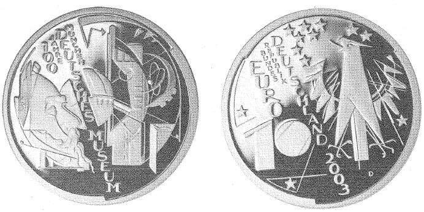

# Bekanntmachung über die Ausprägung von deutschen Euro-Gedenkmünzen im Nennwert von 10 Euro (Gedenkmünze "100 Jahre Deutsches Museum München") (Münz10EuroBek 2003)

Ausfertigungsdatum
:   2003-02-24

Fundstelle
:   BGBl I: 2003, 275

## (XXXX)

Gemäß den §§ 2, 4 und 5 des Münzgesetzes vom 16. Dezember 1999 (BGBl.
I S. 2402) hat die Bundesregierung beschlossen, zum Thema "100 Jahre
Deutsches Museum München" eine deutsche Euro-Gedenkmünze im Nennwert
von 10 Euro prägen zu lassen.
Die Auflage der Münze beträgt 2400000 Stück, darunter 350000 Stück in
Spiegelglanzausführung. Die Prägung erfolgt durch das Bayerische
Hauptmünzamt in München. Die Münze wird ab dem 10. April 2003 in den
Verkehr gebracht. Sie besteht aus einer Legierung von 925
Tausendteilen Silber und 75 Tausendteilen Kupfer, hat einen
Durchmesser von 32,5 Millimetern und eine Masse von 18 Gramm. Das
Gepräge auf beiden Seiten ist erhaben und wird von einem schützenden,
glatten Randstab umgeben.
Die Bildseite kombiniert in experimentell wirkender Gestaltung
markante architektonische und inhaltliche Elemente des Deutschen
Museums mit dem Profil seines Gründers, Oskar von Miller. Die
Aufschrift "100 JAHRE DEUTSCHES MUSEUM MÜNCHEN" in schräger vertikaler
Anordnung gliedert das Münzmotiv in zwei Teile.
Die Wertseite trägt einen Adler, zwölf Sterne, den Nennwert "10 EURO",
die Aufschrift "BUNDESREPUBLIK DEUTSCHLAND", die Jahreszahl 2003 und
das Münzzeichen "D" des Bayerischen Hauptmünzamtes, München.
Der glatte Münzrand enthält in vertiefter Prägung die Inschrift:
"SAMMELN . AUSSTELLEN . FORSCHEN . BILDEN".
Der Entwurf der Münze stammt von Victor Huster, Baden-Baden.

## Schlussformel

Der Bundesminister der Finanzen

## (XXXX)

(Fundstelle: BGBl. I 2003, 275)

