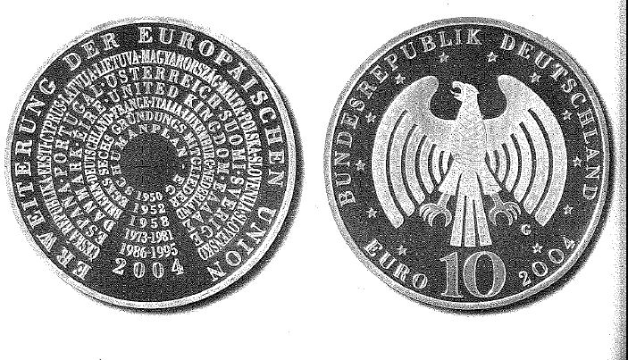

# Bekanntmachung über die Ausprägung von deutschen Euro-Gedenkmünzen im Nennwert von 10 Euro (Gedenkmünze "Erweiterung der Europäischen Union") (Münz10EuroBek 2004-03-24)

Ausfertigungsdatum
:   2004-03-24

Fundstelle
:   BGBl I: 2004, 498

## (XXXX)

Gemäß den §§ 2, 4 und 5 des Münzgesetzes vom 16. Dezember 1999 (BGBl.
I S. 2402) hat die Bundesregierung beschlossen, anlässlich der am 1.
Mai 2004 stattfindenden Erweiterung der Europäischen Union um 10 neue
Mitgliedsstaaten, eine deutsche Euro-Gedenkmünze im Nennwert von 10
Euro prägen zu lassen. Die Auflage der Münze beträgt 2 100 000 Stück,
darunter 300 000 Stück in Spiegelglanzausführung. Die Prägung erfolgt
durch die Staatlichen Münzen Baden-Württemberg, Prägestätte Karlsruhe.
Die Münze wird ab dem 6. Mai 2004 in den Verkehr gebracht. Sie besteht
aus einer Legierung von 925 Tausendteilen Silber und 75 Tausendteilen
Kupfer, hat einen Durchmesser von 32,5 Millimetern und eine Masse von
18 Gramm. Das Gepräge auf beiden Seiten ist erhaben und wird von einem
schützenden, glatten Randstab umgeben. Die Bildseite stellt -
beginnend mit dem Schuman-Plan 1950 - die Etappen der Erweiterung der
Gemeinschaft anhand von Jahreszahlen mit den entsprechend zugeordneten
Beitrittsländern dar. Die Bezeichnung der alten und neuen
Mitgliedsstaaten in ihrer Landessprache ist Ausdruck der nationalen
und kulturellen Vielfalt Europas, die grafisch zusammengefasst wird.
So entsteht der Eindruck von Vielfalt in Einheit. Die formale
Darstellung weist auf ein Forum hin und erinnert so an die
demokratische Tradition. Die Wertseite nimmt in der Ausformung des
Adlers die konzentrische Anordnung der Bildseite gelungen auf.Sie
zeigt ferner den Schriftzug "BUNDESREPUBLIK DEUTSCHLAND", die zwölf
Europa-Sterne, den Nennwert "10 EURO", die Jahreszahl 2004 und das
Münzzeichen "G" der Staatlichen Münzen Baden-Württemberg, Prägestätte
Karlsruhe. Der glatte Münzrand enthält in vertiefter Prägung die
Inschrift:

*
    *   "FREUDE SCHÖNER GÖTTERFUNKEN .".

Der Entwurf der Münze stammt von Frau Aase Thorsen, Molsberg.

## Schlussformel

Der Bundesminister der Finanzen

## (XXXX)

(Fundstelle: BGBl. I 2004, 498)

