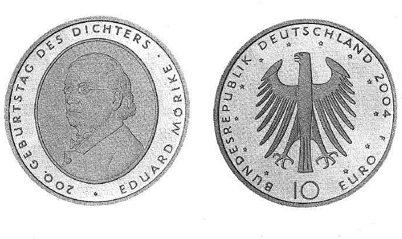

# Bekanntmachung über die Ausprägung von deutschen Euro-Gedenkmünzen im Nennwert von 10 Euro (Gedenkmünze "200. Geburtstag des Dichters Eduard Mörike") (Münz10EuroBek 2004-07-06)

Ausfertigungsdatum
:   2004-07-06

Fundstelle
:   BGBl I: 2004, 1914

## (XXXX)

Gemäß den §§ 2, 4 und 5 des Münzgesetzes vom 16. Dezember 1999 (BGBl.
I S. 2402) hat die Bundesregierung beschlossen, anlässlich des 200.
Geburtstages des Dichters Eduard Mörike eine deutsche Euro-Gedenkmünze
im Nennwert von 10 Euro prägen zu lassen.
Die Auflage der Münze beträgt 2 100 000 Stück, darunter 300 000 Stück
in Spiegelglanzausführung. Die Prägung erfolgt durch die Staatliche
Münze Baden-Württemberg, Prägestätte Stuttgart. Die Münze wird ab dem
9\. September 2004 in den Verkehr gebracht. Sie besteht aus einer
Legierung von 925 Tausendteilen Silber und 75 Tausendteilen Kupfer,
hat einen Durchmesser von 32,5 Millimetern und eine Masse von 18
Gramm. Das Gepräge auf beiden Seiten ist erhaben und wird von einem
schützenden, glatten Rand umgeben.
Die Bildseite zeigt ein Dreiviertelporträt Mörikes aus seiner späteren
Lebenszeit. Es ist der Gewohnheit seiner Zeit entsprechend in einen
ovalen Rahmen gesetzt.
Die Wertseite trägt einen Adler, zwölf Sterne, den Nennwert "10 EURO",
die Umschrift "BUNDESREPUBLIK DEUTSCHLAND", die Jahreszahl 2004 und
das Münzzeichen "F" der Prägestätte Stuttgart.
Der glatte Münzrand enthält in vertiefter Prägung die Inschrift:
"OHNE DAS SCHÖNE \* WAS SOLL DER GEWINN"
Der Entwurf der Münze stammt von Herrn Erich Ott, München.

## Schlussformel

Der Bundesminister der Finanzen

## (XXXX)

(Fundstelle: BGBl. I 2004, 1914)

