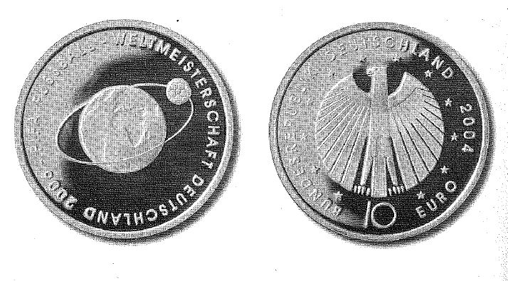

# Bekanntmachung über die Ausprägung von deutschen Euro-Gedenkmünzen im Nennwert von 10 Euro (Gedenkmünze "FIFA Fußball-Weltmeisterschaft Deutschland 2006" - 2. Ausgabe 2004 -) (Münz10EuroBek 2004)

Ausfertigungsdatum
:   2004-01-07

Fundstelle
:   BGBl I: 2004, 70

## (XXXX)

Gemäß den §§ 2, 4 und 5 des Münzgesetzes vom 16. Dezember 1999 (BGBl.
I S. 2402) hat die Bundesregierung beschlossen, zum Thema "FIFA
Fußball-Weltmeisterschaft Deutschland 2006" eine Serie von vier
deutschen Euro-Gedenkmünzen im Nennwert von 10 Euro prägen zu lassen
und jährlich eine Münze in den Jahren 2003 bis 2006 auszugeben.
Die Auflage der Münze des Jahres 2004 (2. Ausgabe 2004) beträgt
4\.400.000 Stück, darunter 400.000 Stück in Spiegelglanzausführung. Die
Prägung erfolgt durch die fünf staatlichen deutschen Münzstätten in
Berlin, München, Stuttgart, Karlsruhe und Hamburg. Die Münze wird ab
dem 5. Februar 2004 in den Verkehr gebracht. Sie besteht aus einer
Legierung von 925 Tausendteilen Silber und 75 Tausendteilen Kupfer,
hat einen Durchmesser von 32,5 Millimetern und eine Masse von 18
Gramm. Das Gepräge auf beiden Seiten ist erhaben und wird von einem
schützenden, glatten Randstab umgeben.
Die Bildseite zeigt einen Globus, der von einem Fußball umkreist wird,
um das Weltumspannende dieser Sportart zu symbolisieren. Das Motiv
wird durch die Umschrift "FIFA FUSSBALL-WELTMEISTERSCHAFT DEUTSCHLAND
2006" umrahmt.
Die Wertseite trägt einen Adler, zwölf Sterne, den Nennwert "10 EURO",
die Umschrift "BUNDESREPUBLIK DEUTSCHLAND" und die Jahreszahl 2004.
Der glatte Münzrand enthält in vertiefter Prägung die Inschrift:

*
    *
        *   "DIE WELT ZU GAST BEI FREUNDEN"

und die Münzzeichen
"A . D . F . G . J" der fünf deutschen Prägestätten.
Der Entwurf der Münze stammt von Lucia Maria Hardegen, Bonn
(Bildseite) und Erich Ott, München (Wertseite).

## Schlussformel

Der Bundesminister der Finanzen

## (XXXX)

(Fundstelle: BGBl. I 2004, 70)

