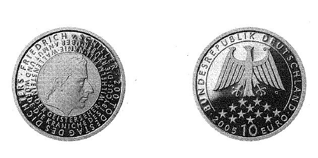

# Bekanntmachung über die Ausprägung von deutschen Euro-Gedenkmünzen im Nennwert von 10 Euro (Gedenkmünze "200. Todestag des Dichters Friedrich von Schiller") (Münz10EuroBek 2005-04)

Ausfertigungsdatum
:   2005-04-04

Fundstelle
:   BGBl I: 2005, 1057

## (XXXX)

Gemäß den §§ 2, 4 und 5 des Münzgesetzes vom 16. Dezember 1999 (BGBl.
I S. 2402) hat die Bundesregierung beschlossen, eine deutsche Euro-
Gedenkmünze "200. Todestag des Dichters Friedrich von Schiller" im
Nennwert von 10 Euro prägen zu lassen.
Die Auflage der Münze beträgt 2.100.000 Stück, darunter 300.000 Stück
in Spiegelglanzausführung. Die Prägung erfolgt durch die Staatlichen
Münzen Baden-Württemberg, Prägestätte Karlsruhe. Die Münze wird ab dem
12\. Mai 2005 in den Verkehr gebracht. Sie besteht aus einer Legierung
von 925 Tausendteilen Silber und 75 Tausendteilen Kupfer, hat einen
Durchmesser von 32,5 Millimetern und eine Masse von 18 Gramm. Das
Gepräge auf beiden Seiten ist erhaben und wird von einem schützenden,
glatten Rand umgeben.
Die Bildseite zeigt eine Porträtdarstellung Schillers, umrahmt von
Titeln ausgewählter dramatischer, lyrischer, epischer und
philosophischer Werke.
Die Wertseite zeigt einen Adler, den Schriftzug "BUNDESREPUBLIK
DEUTSCHLAND", die zwölf Europasterne, die Wertziffer mit der Euro-
Bezeichnung sowie die Jahreszahl "2005" und das Münzzeichen "G" der
Prägestätte Karlsruhe.
Der glatte Münzrand enthält in vertiefter Prägung die Inschrift:
"ERNST IST DAS LEBEN
. HEITER IST DIE KUNST".
Der Entwurf der Münze stammt von Herrn Carsten Theumer aus Höhnstedt.

## Schlussformel

Der Bundesminister der Finanzen

## (XXXX)

(Fundstelle: BGBl. I 2005, 1057)

