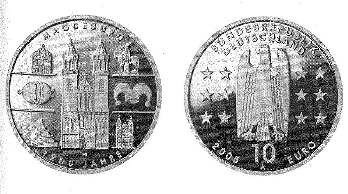

# Bekanntmachung über die Ausprägung von deutschen Euro-Gedenkmünzen im Nennwert von 10 Euro (Gedenkmünze "1.200 Jahre Magdeburg") (Münz10EuroBek 2005-07)

Ausfertigungsdatum
:   2005-07-19

Fundstelle
:   BGBl I: 2005, 2299

## (XXXX)

Gemäß den §§ 2, 4 und 5 des Münzgesetzes vom 16. Dezember 1999 (BGBl.
I S. 2402) hat die Bundesregierung beschlossen, zur Würdigung des
1200-jährigen Jubiläums der Stadt Magdeburg eine deutsche Euro-
Gedenkmünze im Nennwert von 10 Euro prägen zu lassen.
Die Auflage der Münze beträgt 2.100.000 Stück, darunter 300.000 Stück
in Spiegelglanzausführung. Die Prägung erfolgt durch die Staatliche
Münze Berlin. Die Münze wird ab dem 8. September 2005 in den Verkehr
gebracht. Sie besteht aus einer Legierung von 925 Tausendteilen Silber
und 75 Tausendteilen Kupfer, hat einen Durchmesser von 32,5
Millimetern und eine Masse von 18 Gramm. Das Gepräge auf beiden Seiten
ist erhaben und wird von einem schützenden, glatten Randstab umgeben.
Die Bildseite zeigt den Magdeburger Dom, der durch die hervorragende
künstlerische Umsetzung mit seiner realen Bedeutung und seinem Wert
als Sinnbild der Stadt korrespondiert. Er wird umrahmt von Symbolen
für die bestimmenden Traditionen, Brüche und Neuanfänge der Geschichte
Magdeburgs.
Die Wertseite nimmt mit der Anordnung von Adler, Schrift und Europa-
Sternen die harmonische Gestaltung der Bildseite hervorragend auf. Sie
zeigt ferner die Wertziffer und Wertbezeichnung, die Jahreszahl 2005
sowie das Prägezeichen "A" der Staatlichen Münze Berlin.
Der glatte Münzrand enthält in vertiefter Prägung die Inschrift:

*
    *   "MAGADOBURG 805 - MAGDEBURG 2005".

Der Entwurf der Münze stammt von Herrn Heinz Hoyer, Berlin.

## Schlussformel

Der Bundesminister der Finanzen

## (XXXX)

(Fundstelle: BGBl. I 2005, 2299)

