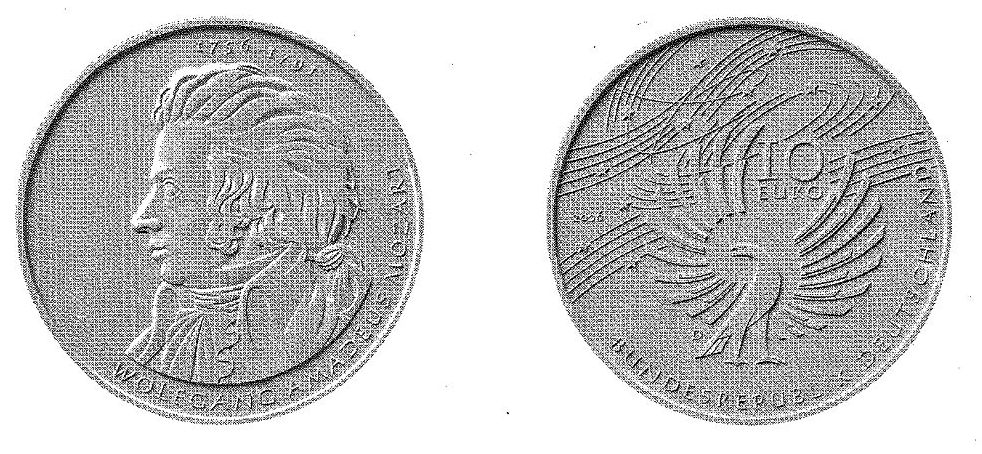

# Bekanntmachung über die Ausprägung von deutschen Euro-Gedenkmünzen im Nennwert von 10 Euro (Gedenkmünze "250. Geburtstag von Wolfgang Amadeus Mozart") (Münz10EuroBek 2005-11)

Ausfertigungsdatum
:   2005-11-30

Fundstelle
:   BGBl I: 2005, 3389

## (XXXX)

Gemäß den §§ 2, 4 und 5 des Münzgesetzes vom 16. Dezember 1999 (BGBl.
I S. 2402) hat die Bundesregierung beschlossen, zur Würdigung des 250.
Geburtstages von Wolfgang Amadeus Mozart eine deutsche Euro-
Gedenkmünze im Nennwert von 10 Euro prägen zu lassen.
Die Auflage der Münze beträgt 1.900.000 Stück, darunter 300.000 Stück
in Spiegelglanzausführung. Die Prägung erfolgt durch das Bayerische
Hauptmünzamt, München. Die Münze wird ab dem 2. Januar 2006 in den
Verkehr gebracht. Sie besteht aus einer Legierung von 925
Tausendteilen Silber und 75 Tausendteilen Kupfer, hat einen
Durchmesser von 32,5 Millimetern und eine Masse von 18 Gramm. Das
Gepräge auf beiden Seiten ist erhaben und wird von einem schützenden,
glatten Randstab umgeben.
Die Bildseite zeigt - in künstlerisch überzeugender Form - ein klar
dargestelltes und eindeutig erkennbares Portrait Mozarts, das
insbesondere durch seine große Dynamik im Ausdruck überzeugt.
Die Wertseite korrespondiert mit der Bildseite in hervorragender
Weise. Die beschwingte Darstellung des Adlers und die Anordnung der
Sterne innerhalb von Notenlinien stellen eine zeitgemäße und
originelle Lösung dar. Ferner zeigt die Wertseite die Wertziffer und
Wertbezeichnung, die Jahreszahl 2006 sowie das Prägezeichen "D" des
Bayerischen Hauptmünzamtes, München.
Der glatte Münzrand enthält in vertiefter Prägung die Inschrift:

*
    *
        *   "- MOZART - DIE WELT HAT EINEN SINN".

Der Entwurf der Münze stammt von Herrn Jordi Regel, Berlin.

## Schlussformel

Der Bundesminister der Finanzen

## (XXXX)

(Fundstelle: BGBl. I 2005, 3389)

