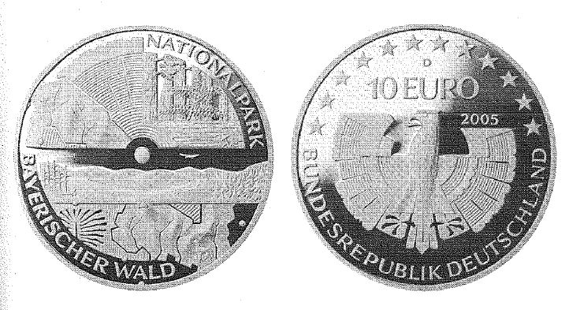

# Bekanntmachung über die Ausprägung von deutschen Euro-Gedenkmünzen im Nennwert von 10 Euro (Gedenkmünze "Nationalpark Bayerischer Wald") (Münz10EuroBek 2005)

Ausfertigungsdatum
:   2005-01-21

Fundstelle
:   BGBl I: 2005, 197

## (XXXX)

Gemäß den §§ 2, 4 und 5 des Münzgesetzes vom 16. Dezember 1999 (BGBl.
I S. 2402) hat die Bundesregierung beschlossen, eine deutsche Euro-
Gedenkmünze "Nationalpark Bayerischer Wald" im Nennwert von 10 Euro
prägen zu lassen.

Die Auflage der Münze beträgt 2 100 000 Stück, darunter 300 000 Stück
in Spiegelglanzausführung. Die Prägung erfolgt durch das Bayerische
Hauptmünzamt, München. Die Münze wird ab dem 7. April 2005 in den
Verkehr gebracht. Sie besteht aus eine Legierung von 925 Tausendteilen
Silber und 75 Tausendteilen Kupfer, hat einen Durchmesser von 32,5
Millimetern und eine Masse von 18 Gramm. Das Gepräge auf beiden Seiten
ist erhaben und wird von einem schützenden, glatten Rand umgeben. Die
Bildseite zeigt eine Baumscheibe, in welche die Flächenumrisse des
Nationalparks mit seinen wesentlichen Landschaftselementen integriert
sind.

Die Wertseite zeigt einen Adler, den Schriftzug "BUNDESREPUBLIK
DEUTSCHLAND", die zwölf Europasterne, die Wertziffer mit der Euro-
Bezeichnung sowie die Jahreszahl "2005" und das Münzzeichen "D" des
Bayerischen Hauptmünzamtes, München.

Der glatte Münzrand enthält in vertiefter Prägung die Inschrift:
"GRENZENLOSE WALDWILDNIS". Der Entwurf der Münze stammt von Herrn Bodo
Broschat, Berlin.

## Schlussformel

Der Bundesminister der Finanzen

## (XXXX)

(Fundstelle: BGBl. I 2005, 197)

