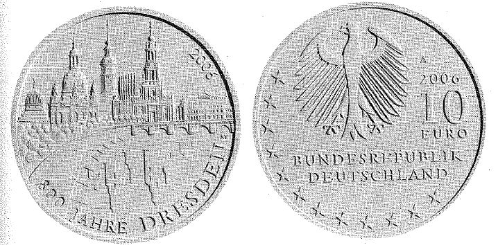

# Bekanntmachung über die Ausprägung von deutschen Euro-Gedenkmünzen im  Nennwert von 10 Euro (Gedenkmünze "800 Jahre Dresden") (Münz10EuroBek 2006-07-12)

Ausfertigungsdatum
:   2006-07-12

Fundstelle
:   BGBl I: 2006, 1703

## (XXXX)

Gemäß den §§ 2, 4 und 5 des Münzgesetzes vom 16. Dezember 1999 (BGBl.
I S. 2402) hat die Bundesregierung beschlossen, zur Würdigung von 800
Jahre Dresden eine deutsche Euro-Gedenkmünze im Nennwert von 10 Euro
prägen zu lassen.
Die Auflage der Münze beträgt 1.900.000 Stück, darunter 300.000 Stück
in Spiegelglanzausführung. Die Prägung erfolgt durch die Staatliche
Münze Berlin. Die Münze wird ab dem 24. August 2006 in den Verkehr
gebracht. Sie besteht aus einer Legierung von 925 Tausendteilen Silber
und 75 Tausendteilen Kupfer, hat einen Durchmesser von 32,5
Millimetern und eine Masse von 18 Gramm. Das Gepräge auf beiden Seiten
ist erhaben und wird von einem schützenden glatten Randstab umgeben.
Die Bildseite zeigt die das Stadtbild prägenden historischen Gebäude
in Verbindung zur Elbe. Mit der Spiegelung im Fluss ist es dem
Künstler in hervorragender Weise gelungen, Wiederaufbau und Zerstörung
der Stadt, die Teil des Mythos von Dresden sind, greifbar in das
Münzrund einzubeziehen.
Die Wertseite zeigt einen künstlerisch gelungenen Adler, der mit der
Bildseite harmoniert, den Schriftzug "BUNDESREPUBLIK DEUTSCHLAND", die
zwölf Europasterne, die Wertziffer mit der Euro-Bezeichnung sowie die
Jahreszahl "2006" und das Münzzeichen A der Staatlichen Münze Berlin.
Der glatte Münzrand enthält in vertiefter Prägung die für die
Geschichte Dresdens prägnanten Jahreszahlen:

*
    *
        *
            *   "1206 . 1485 . 1547 . 1697 . 1832 . 1945 . 1989 . 2006".

Der Entwurf der Münze stammt von Herrn Heinz Hoyer, Berlin.

## Schlussformel

Der Bundesminister der Finanzen

## (XXXX)

(Fundstelle: BGBl. I 2006, 1703)

