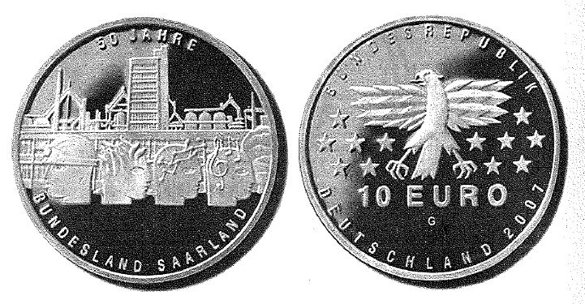

# Bekanntmachung über die Ausprägung von deutschen Euro-Gedenkmünzen im  Nennwert von 10 Euro (Gedenkmünze "50 Jahre Bundesland Saarland") (Münz10EuroBek 2006-11-17)

Ausfertigungsdatum
:   2006-11-17

Fundstelle
:   BGBl I: 2006, 2666

## (XXXX)

Gemäß den §§ 2, 4 und 5 des Münzgesetzes vom 16. Dezember 1999 (BGBl.
I S. 2402) hat die Bundesregierung beschlossen, zur Würdigung der
50-jährigen Zugehörigkeit des Saarlandes zur Bundesrepublik
Deutschland eine deutsche Euro-Gedenkmünze im Nennwert von 10 Euro
prägen zu lassen.
Die Auflage der Münze beträgt 1.900.000 Stück, darunter 300.000 Stück
in Spiegelglanzausführung. Die Prägung erfolgt durch die Staatlichen
Münzen Baden-Württemberg, Prägestätte Karlsruhe.
Die Münze wird ab dem 18. Januar 2007 in den Verkehr gebracht. Sie
besteht aus einer Legierung von 925 Tausendteilen Silber und 75
Tausendteilen Kupfer, hat einen Durchmesser von 32,5 Millimetern und
eine Masse von 18 Gramm. Das Gepräge auf beiden Seiten ist erhaben und
wird von einem schützenden, glatten Randstab umgeben.
Die Bildseite zeigt eine einprägsam geformte, historisch bedeutsame
Architekturkulisse aus dem Weltkulturerbe Völklinger Hütte und der
Saarländischen Universitäts- und Landesbibliothek in Saarbrücken. Eine
den Architekturen vorangestellte Zeile von vier gleich großen
symbolisch gestalteten Köpfen verkörpert Bergbau, Industrie, neue
Technologien und Kultur.
Die Wertseite, ebenso streng horizontal geordnet wie die Bildseite,
zeigt mit Adler, den zwölf europäischen Sternen im Kontext des 10
-Euro-Nominals und dem Münzzeichen G der Prägestätte Karlsruhe ein gut
strukturiertes Bild. Klare und in ihren Größen wohlproportionierte
Grotesk-Versalien bilden eine sachliche, sehr zeitgemäße Umschrift
"BUNDESREPUBLIK DEUTSCHLAND 2007".
Der glatte Münzrand enthält in vertiefter Prägung die Inschrift:

*
    *
        *   "Deutschland . Frankreich . Europa .".

Der Entwurf der Münze stammt von Frau Erika Binz-Blanke, Baden-
Württemberg.

## Schlussformel

Der Bundesminister der Finanzen

## (XXXX)

(Fundstelle: BGBl. I 2006, 2666)

