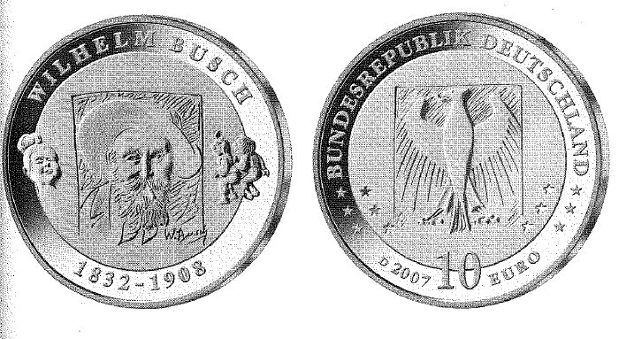

# Bekanntmachung über die Ausprägung von deutschen Euro-Gedenkmünzen im  Nennwert von 10 Euro (Gedenkmünze "175. Geburtstag von Wilhelm Busch") (Münz10EuroBek 2007-05-05)

Ausfertigungsdatum
:   2007-05-05

Fundstelle
:   BGBl I: 2007, 743

## (XXXX)

Gemäß den §§ 2, 4 und 5 des Münzgesetzes vom 16. Dezember 1999 (BGBl.
I S. 2402) hat die Bundesregierung beschlossen, aus Anlass des 175.
Geburtstages von Wilhelm Busch eine deutsche Euro-Gedenkmünze im
Nennwert von 10 Euro prägen zu lassen.
Die Auflage der Münze beträgt 1.900.000 Stück, darunter 300.000 Stück
in Spiegelglanzausführung. Die Prägung erfolgt durch das Bayerische
Hauptmünzamt, München.
Die Münze wird ab dem 14. Juni 2007 in den Verkehr gebracht. Sie
besteht aus einer Legierung von 925 Tausendteilen Silber und 75
Tausendteilen Kupfer, hat einen Durchmesser von 32,5 Millimetern und
eine Masse von 18 Gramm. Das Gepräge auf beiden Seiten ist erhaben und
wird von einem schützenden, glatten Randstab umgeben.
Die Bildseite zeigt eine überzeugende Abbildung Wilhelm Busch's, die
sich auf originelle Weise von konventionellen Darstellungen abhebt.
Sie wird in gelungener Form durch das Grundformat seiner in Holz
gestochenen Bildergeschichten ergänzt, von denen der Künstler zwei
(Max und Moritz, Fromme Helene) exemplarisch aufgreift.
Die Wertseite harmoniert in künstlerisch anschaulicher Weise mit der
Bildseite. Sie zeigt den Bundesadler, den Schriftzug "BUNDESREPUBLIK
DEUTSCHLAND", die Wertziffer und Wertbezeichnung, die Jahreszahl 2007
sowie das Prägezeichen "D" des Bayerischen Hauptmünzamtes, München.
Der glatte Münzrand enthält in vertiefter Prägung die Inschrift:

*   "WER RUDERT, SIEHT DEN GRUND NICHT.".

Der Entwurf der Münze stammt von Herrn Othmar Kukula aus Neuhausen.

## Schlussformel

Der Bundesminister der Finanzen

## (XXXX)

(Fundstelle: BGBl. I 2007, 743)

