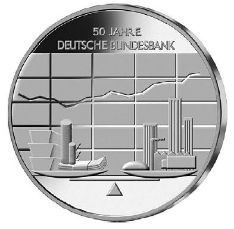
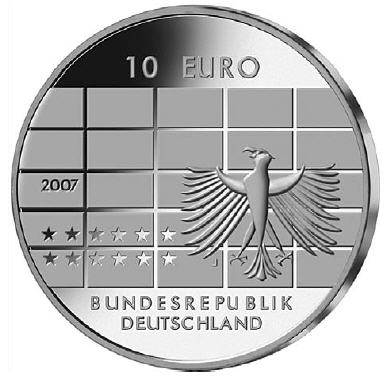

# Bekanntmachung über die Ausprägung von deutschen Euro-Gedenkmünzen im  Nennwert von 10 Euro (Gedenkmünze "50 Jahre Deutsche Bundesbank") (Münz10EuroBek 2007-05-15)

Ausfertigungsdatum
:   2007-05-15

Fundstelle
:   BGBl I: 2007, 956

## (XXXX)

Gemäß den §§ 2, 4 und 5 des Münzgesetzes vom 16. Dezember 1999 (BGBl.
I S. 2402) hat die Bundesregierung beschlossen, aus Anlass des
50-jährigen Bestehens der Deutschen Bundesbank eine deutsche Euro-
Gedenkmünze im Nennwert von 10 Euro prägen zu lassen. Die Auflage
beträgt 1.900.000 Stück, darunter 300.000 Stück in
Spiegelglanzausführung. Die Prägung erfolgt durch die Hamburgische
Münze.
Die Münze wird ab dem 9. August 2007 in den Verkehr gebracht. Sie
besteht aus einer Legierung von 925 Tausendteilen Silber und 75
Tausendteilen Kupfer, hat einen Durchmesser von 32,5 Millimetern und
eine Masse von 18 Gramm. Das Gepräge auf beiden Seiten ist erhaben und
wird von einem schützenden, glatten Randstab umgeben.
Die Bildseite zeigt auf der linken Seite einer Waage Objekte, die den
monetären Teil der Wirtschaft symbolisieren (Geld, Währungsreserven)
und auf der rechten Seite die reale Wirtschaft
(Produktionsunternehmen, Banken). Über 50 Jahre hat die Deutsche
Bundesbank zum Ausgleich beider Teile und damit zum
Wirtschaftswachstum beigetragen; dies hat die Künstlerin im
Hintergrund mit dem fünf Jahrzehnte umfassenden Diagramm verdeutlicht.
Auf der Wertseite hat die Künstlerin das Diagrammelement wieder
aufgenommen, wodurch eine gute Korrespondenz zur Bildseite hergestellt
wird. Der Adler ist würdevoll gestaltet und künstlerisch gut
ausgearbeitet. Die Wertseite zeigt weiterhin den Schriftzug
"BUNDESREPUBLIK DEUTSCHLAND", die Wertziffer und Wertbezeichnung, die
Jahreszahl 2007 sowie das Prägezeichen "J" der Hamburgischen Münze.
Der glatte Münzrand enthält in vertiefter Prägung die Inschrift:

*
    *   "PREISSTABILITÄT GEWÄHRLEISTEN.".

Der Entwurf der Münze stammt von Frau Susanne Kraißer, Belzig.

## Schlussformel

Der Bundesminister der Finanzen

## (XXXX)

( Fundstelle: BGBl. I 2007, 956 )

*    *        
    *        

