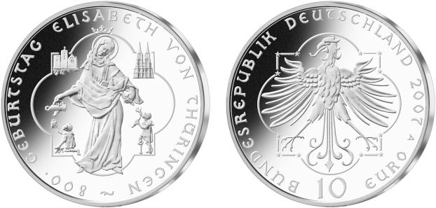

# Bekanntmachung über die Ausprägung von deutschen Euro-Gedenkmünzen im Nennwert von 10 Euro (Gedenkmünze „800. Geburtstag Elisabeth von Thüringen“) (Münz10EuroBek 2007-10-11)

Ausfertigungsdatum
:   2007-10-11

Fundstelle
:   BGBl I: 2007, 2464

## (XXXX)

Gemäß den §§ 2, 4 und 5 des Münzgesetzes vom 16. Dezember 1999 (BGBl.
I S. 2402) hat die Bundesregierung beschlossen, aus Anlass des 800.
Geburtstages der Elisabeth von Thüringen eine deutsche Euro-
Gedenkmünze im Nennwert von 10 Euro prägen zu lassen. Die Auflage
beträgt maximal 1.900.000 Stück, darunter maximal 300.000 Stück in
Spiegelglanzausführung. Die Prägung erfolgt durch die Staatliche Münze
Berlin. Die Münze wird ab dem 8. November 2007 in den Verkehr
gebracht. Sie besteht aus einer Legierung von 925 Tausendteilen Silber
und 75 Tausendteilen Kupfer, hat einen Durchmesser von 32,5
Millimetern und eine Masse von 18 Gramm. Das Gepräge auf beiden Seiten
ist erhaben und wird von einem schützenden, glatten Randstab umgeben.
Die Bildseite zeigt durch vier Motive das Wirken der Heiligen
Elisabeth von Thüringen: Speisung der Armen im unteren und ihre
Lebensmittelpunkte im oberen Teil. Diese Motive befinden sich in den
Winkeln eines Vierpasses, während die Heilige in den Mittelpunkt
gerückt ist. Die Figur Elisabeths bringt ihre Aufopferung für die
Bedürftigen und Kranken zum Ausdruck. Die Wertseite zeigt einen sehr
gut ausgearbeiteten, gotisch anmutenden Adler. Die gewählte
Unzialschrift und der Vierpass, der die 12 Sterne enthält, verbinden
Bild- und Wertseite in hervorragender Weise. Zudem zeigt die Wertseite
den Schriftzug „BUNDESREPUBLIK DEUTSCHLAND“, die Wertziffer und
Wertbezeichnung, die Jahreszahl 2007 sowie das Prägezeichen „A“ der
Staatlichen Münze Berlin. Der glatte Münzrand enthält in vertiefter
Prägung die Inschrift: „WIR SOLLEN DIE MENSCHEN FROH MACHEN \*“. Der
Entwurf der Münze stammt von Frau Barbara G. Ruppel, Krailling.

## Schlussformel

Der Bundesminister der Finanzen

## (XXXX)

( Fundstelle: BGBl. I 2007, 2464 )

