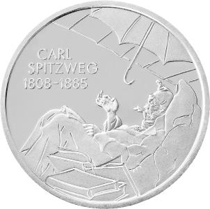
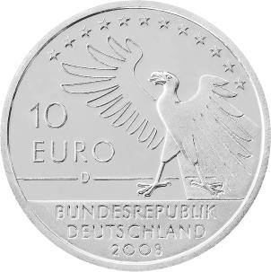

# Bekanntmachung über die Ausprägung von deutschen Euro-Gedenkmünzen im Nennwert von 10 Euro (Gedenkmünze „200. Geburtstag Carl Spitzweg“) (Münz10EuroBek 2008-01-19)

Ausfertigungsdatum
:   2008-01-19

Fundstelle
:   BGBl I: 2008, 46

## (XXXX)

Gemäß den §§ 2, 4 und 5 des Münzgesetzes vom 16. Dezember 1999 (BGBl.
I S. 2402) hat die Bundesregierung beschlossen, aus Anlass des 200.
Geburtstages von Carl Spitzweg eine deutsche Euro-Gedenkmünze im
Nennwert von 10 Euro prägen zu lassen. Die Auflage der Münze beträgt
1\.760.000 Stück, darunter maximal 260.000 Stück in
Spiegelglanzausführung. Die Prägung erfolgt durch das Bayerische
Hauptmünzamt, München.

Die Münze wird ab dem 7. Februar 2008 in den Verkehr gebracht. Sie
besteht aus einer Legierung von 925 Tausendteilen Silber und 75
Tausendteilen Kupfer, hat einen Durchmesser von 32,5 Millimetern und
eine Masse von 18 Gramm. Das Gepräge auf beiden Seiten ist erhaben und
wird von einem schützenden, glatten Randstab umgeben.

Die Bildseite zeigt einen Ausschnitt aus dem bekanntesten Gemälde
Spitzwegs „Der arme Poet“: Unter einem undichten Dach liegt er im
Schutze eines aufgespannten Regenschirms und umgeben von Büchern auf
seinem Lager, epische Verse skandierend. Während seine Umgebung
skizzenhaft angelegt ist, ist die zentrale Szene fein plastisch
herausgearbeitet. Anspruch und Realität, die Brüchigkeit der scheinbar
heilen Welt des Biedermeier sind in zeitgemäßer Bildsprache
künstlerisch herausragend verbildlicht.

Die Wertseite harmoniert in künstlerisch überzeugender Weise mit der
Bildseite. Sie zeigt einen Adler, den Schriftzug „BUNDESREPUBLIK
DEUTSCHLAND“, die Wertziffer und Wertbezeichnung, die Jahreszahl 2008
sowie das Prägezeichen „D“ des Bayerischen Hauptmünzamtes, München.

Der glatte Münzrand enthält in vertiefter Prägung die Inschrift:
„ACH, DIE VERGANGENHEIT IST SCHÖN “.

Es handelt sich hierbei um ein ironisch zu verstehendes Zitat aus
einem Brief Carl Spitzwegs aus den 40er Jahren des 19. Jahrhunderts.

Der Entwurf der Münze stammt von Herrn Hannes Dauer, Schönbrunn.c

## Schlussformel

Der Bundesminister der Finanzen

## (XXXX)

( Fundstelle: BGBl. I 2008, 46 )

*    *        
    *        

