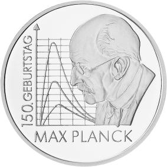

# Bekanntmachung über die Ausprägung von deutschen Euro-Gedenkmünzen im Nennwert von 10 Euro (Gedenkmünze „150. Geburtstag Max Planck“) (Münz10EuroBek 2008-03-17)

Ausfertigungsdatum
:   2008-03-17

Fundstelle
:   BGBl I: 2008, 483

## (XXXX)

Gemäß den §§ 2, 4 und 5 des Münzgesetzes vom 16. Dezember 1999 (BGBl.
I S. 2402) hat die Bundesregierung beschlossen, aus Anlass des 150.
Geburtstages von Max Planck eine deutsche Euro-Gedenkmünze im Nennwert
von 10 Euro prägen zu lassen.

Die Auflage der Münze beträgt 1.760.000 Stück, darunter maximal
260\.000 Stück in Spiegelglanzausführung. Die Prägung erfolgt durch die
Staatlichen Münzen Baden-Württemberg, Prägestätte Stuttgart.

Die Münze wird ab dem 10. April 2008 in den Verkehr gebracht. Sie
besteht aus einer Legierung von 925 Tausendteilen Silber und 75
Tausendteilen Kupfer, hat einen Durchmesser von 32,5 Millimetern und
eine Masse von 18 Gramm. Das Gepräge auf beiden Seiten ist erhaben und
wird von einem schützenden, glatten Randstab umgeben.

Die Bildseite zeigt eine gelungene Kombination von Portrait und
wissenschaftlicher Grafik. Das künstlerisch überzeugende Portrait
trifft die Persönlichkeit Plancks, indem es seine Nachdenklichkeit zum
Ausdruck bringt. Die gezeigten Kurven sind charakteristisch für die
Wärmestrahlung, die einen der Forschungsschwerpunkte in Plancks
wissenschaftlicher Arbeit bildete.

Die Wertseite korrespondiert harmonisch mit der Bildseite. Sie zeigt
einen Adler, den Schriftzug „BUNDESREPUBLIK DEUTSCHLAND“, die
Wertziffer und Wertbezeichnung, die Jahreszahl 2008, die zwölf
Europasterne sowie das Prägezeichen „F“ der Staatlichen Münzen Baden-
Württemberg, Prägestätte Stuttgart.

Der glatte Münzrand enthält in vertiefter Prägung die Inschrift (Zitat
von Max Planck):

*    *   „DEM ANWENDEN MUSS
        DAS ERKENNEN VORAUSGEHEN*                       “.

Der Entwurf der Münze stammt von Herrn Michael Otto, Rodenbach.

## Schlussformel

Der Bundesminister der Finanzen

## (XXXX)

( Fundstelle: BGBl. I 2008, 483 )

*    *        
    *        

