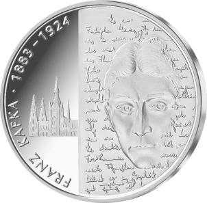
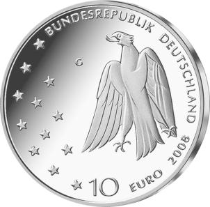

# Bekanntmachung über die Ausprägung von deutschen Euro-Gedenkmünzen im Nennwert von 10 Euro (Gedenkmünze „125. Geburtstag Franz Kafka“) (Münz10EuroBek 2008-04-24)

Ausfertigungsdatum
:   2008-04-24

Fundstelle
:   BGBl I: 2008, 770

## (XXXX)

Gemäß den §§ 2, 4 und 5 des Münzgesetzes vom 16. Dezember 1999 (BGBl.
I S. 2402) hat die Bundesregierung beschlossen, aus Anlass des 125.
Geburtstages von Franz Kafka eine deutsche Euro-Gedenkmünze im
Nennwert von 10 Euro prägen zu lassen. Die Auflage der Münze beträgt
1\.760.000 Stück, darunter maximal 260.000 Stück in
Spiegelglanzausführung. Die Prägung erfolgt durch die Staatlichen
Münzen Baden-Württemberg, Prägestätte Karlsruhe.

Die Münze wird ab dem 10. Juli 2008 in den Verkehr gebracht. Sie
besteht aus einer Legierung von 925 Tausendteilen Silber und 75
Tausendteilen Kupfer, hat einen Durchmesser von 32,5 Millimetern und
eine Masse von 18 Gramm. Das Gepräge auf beiden Seiten ist erhaben und
wird von einem schützenden, glatten Randstab umgeben.

Die Bildseite ist senkrecht in zwei Teile aufgeteilt. Der rechte Teil
zeigt das Porträt Kafkas in ein Textgeflecht eingesenkt. Zugleich
ragen seine Gesichtszüge aus dem Text heraus und treten dem Betrachter
entgegen. Diese Doppeldeutigkeit thematisiert in gelungener Form das
gerade auch für Kafka wichtige, gespannte Verhältnis des Autors zu
seinen Texten. Der linke Teil zeigt auf dem Münzgrund den Veitsdom,
nicht nur als ein Kennzeichen Prags und als Schauplatz in Kafkas
„Prozess“, sondern ebenso als Andeutung des historisch-kulturellen
Hintergrunds der Lebensgeschichte von Kafka.

Die Wertseite zeigt einen Adler, den Schriftzug „BUNDESREPUBLIK
DEUTSCHLAND“, die zwölf Europa-Sterne, die Wertziffer mit der Euro-
Bezeichnung sowie die Jahreszahl 2008 und das Münzzeichen „G“ der
Staatlichen Münzen Baden-Württemberg, Prägestätte Karlsruhe.

Der glatte Münzrand enthält in vertiefter Prägung die Inschrift:

„EIN KÄFIG GING EINEN VOGEL SUCHEN*             “.

Dieser berühmte Satz Kafkas ist eine Anspielung auf die tschechische
Bedeutung seines Namens (kavka = Dohle).

Der Entwurf der Münze stammt von Herrn Frantisek Chochola, Hamburg.

## Schlussformel

Der Bundesminister der Finanzen

## (XXXX)

( Fundstelle: BGBl. I 2008, 770 )

*    *        
    *        

