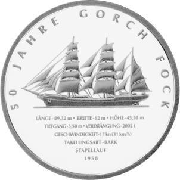
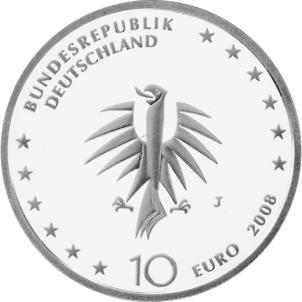

# Bekanntmachung über die Ausprägung von deutschen Euro-Gedenkmünzen im Nennwert von 10 Euro (Gedenkmünze „50 Jahre Gorch Fock“) (Münz10EuroBek 2008-05-28)

Ausfertigungsdatum
:   2008-05-28

Fundstelle
:   BGBl I: 2008, 991

## (XXXX)

Gemäß den §§ 2, 4 und 5 des Münzgesetzes vom 16. Dezember 1999 (BGBl.
I S. 2402) hat die Bundesregierung beschlossen, aus Anlass des 50.
Jahrestages der Inbetriebnahme des Segelschulschiffes „Gorch Fock“
eine deutsche Euro-Gedenkmünze im Nennwert von 10 Euro prägen zu
lassen. Die Auflage der Münze beträgt 1.760.000 Stück, darunter
maximal 260 000 Stück in Spiegelglanzausführung. Die Prägung erfolgt
durch die Hamburgische Münze.

Die Münze wird ab dem 7. August 2008 in den Verkehr gebracht. Sie
besteht aus einer Legierung von 925 Tausendteilen Silber und 75
Tausendteilen Kupfer, hat einen Durchmesser von 32,5 Millimetern und
eine Masse von 18 Gramm. Das Gepräge auf beiden Seiten ist erhaben und
wird von einem schützenden, glatten Randstab umgeben.

Die Bildseite zeigt die spezifischen Merkmale des Segelschulschiffes
Gorch Fock. Das Bildmotiv wird von der Umschrift „50 Jahre Gorch Fock“
eingefasst. Die Konturen des Schiffes spiegeln sich auf originelle
Weise in der unteren Münzhälfte. Aus einigem Abstand betrachtet wirkt
das Schriftfeld wie ein Schatten. Bei näherem Hinsehen entdeckt der
Betrachter technische Angaben und das Datum des Stapellaufs.

Die Wertseite zeigt einen Adler, den Schriftzug „BUNDESREPUBLIK
DEUTSCHLAND“, die zwölf Europa-Sterne, die Wertziffer mit der Euro-
Bezeichnung sowie die Jahreszahl 2008 und das Münzzeichen „J“ der
Hamburgischen Münze.

Der glatte Münzrand enthält in vertiefter Prägung die Inschrift:

„SEEFAHRT IST NOT*             “.

Hierbei handelt es sich um den Titel des Hauptwerkes des
Schriftstellers Johann Kinau, dessen Pseudonym Gorch Fock der Name des
Segelschulschiffes ist.

Der Entwurf der Münze stammt von Herrn Frantisek Chochola, Hamburg.

## Schlussformel

Der Bundesminister der Finanzen

## (XXXX)

( Fundstelle: BGBl. I 2008, 991 )

*    *        
    *        

