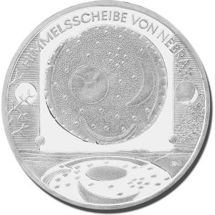
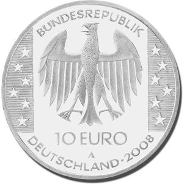

# Bekanntmachung über die Ausprägung von deutschen Euro-Gedenkmünzen im Nennwert von 10 Euro (Gedenkmünze „Himmelsscheibe von Nebra“) (Münz10EuroBek 2008-08-25)

Ausfertigungsdatum
:   2008-08-25

Fundstelle
:   BGBl I: 2008, 1785

## (XXXX)

Gemäß den §§ 2, 4 und 5 des Münzgesetzes vom 16. Dezember 1999 (BGBl.
I S. 2402) hat die Bundesregierung beschlossen, aus Anlass der am 4.
Juli 1999 im Ziegelrodauer Forst bei Nebra, Sachsen-Anhalt, gefundenen
„Himmelsscheibe“, bei der es sich um einen Schlüsselfund für die
europäische Vorgeschichte, die Astronomiegeschichte sowie die frühe
Religionsgeschichte handelt, eine deutsche Euro-Gedenkmünze im
Nennwert von 10 Euro prägen zu lassen. Die Auflage der Münze beträgt
1 760 000 Stück, darunter maximal 260 000 Stück in
Spiegelglanzausführung. Die Prägung erfolgt durch die Staatliche Münze
Berlin.

Die Münze wird ab dem 9. Oktober 2008 in den Verkehr gebracht. Sie
besteht aus einer Legierung von 925 Tausendteilen Silber und 75
Tausendteilen Kupfer, hat einen Durchmesser von 32,5 Millimetern und
eine Masse von 18 Gramm. Das Gepräge auf beiden Seiten ist erhaben und
wird von einem schützenden, glatten Randstab umgeben.

Auf der Bildseite der Münze ist der astronomische Inhalt der
Himmelsscheibe von Nebra sowohl realistisch als auch stilisiert
dargestellt. Im unteren Teil der Bildseite werden vom Fundort aus
gesehen die Sichtachsen der Horizontbögen in Bezug zur Landschaft
abgebildet. Auf den seitlichen Feldern sind der Sichelmond mit
Frühlingszweigen und der herbstliche Vollmond mit kahlen Zweigen
wiedergegeben. Das wichtige Bildelement der Plejaden wird in seiner
korrekten astronomischen Stellung in Form von Sternen aufgenommen,
über die eine Korrespondenz zu den Europa-Sternen der Wertseite
hergestellt wird.

Die Wertseite zeigt einen Adler, den Schriftzug „BUNDESREPUBLIK
DEUTSCHLAND“, die zwölf Europa-Sterne, die Wertziffer mit der Euro-
Bezeichnung sowie die Jahreszahl 2008 und das Münzzeichen „A“ der
Staatlichen Münze Berlin.

Der glatte Münzrand enthält in vertiefter Prägung die Inschrift:

„DER GESCHMIEDETE HIMMEL IM HERZEN EUROPAS“.

Der Entwurf der Münze stammt von Herrn Bodo Broschat, Berlin.

## Schlussformel

Der Bundesminister der Finanzen

## (XXXX)

( Fundstelle: BGBl. I 2008, 1785 )

*    *        
    *        

