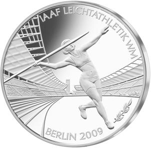

# Bekanntmachung über die Ausprägung von deutschen Euro-Gedenkmünzen im Nennwert von 10 Euro (Gedenkmünze „IAAF Leichtathletik WM Berlin 2009“) (Münz10EuroBek 2009-03-04)

Ausfertigungsdatum
:   2009-03-04

Fundstelle
:   BGBl I: 2009, 460

## (XXXX)

Gemäß den §§ 2, 4 und 5 des Münzgesetzes vom 16. Dezember 1999 (BGBl.
I S. 2402) hat die Bundesregierung beschlossen, aus Anlass der IAAF
Leichtathletik Weltmeisterschaften 2009 in Berlin eine deutsche Euro-
Gedenkmünze im Nennwert von 10 Euro prägen zu lassen. Die Auflage der
Münze beträgt 1 890 000 Stück, darunter maximal 200 000 Stück in
Spiegelglanzausführung. Die Prägung erfolgt durch die fünf staatlichen
deutschen Münzstätten in Berlin, München, Stuttgart, Karlsruhe und
Hamburg.
Die Münze wird ab dem 9. April 2009 in den Verkehr gebracht. Sie
besteht aus einer Legierung von 925 Tausendteilen Silber und 75
Tausendteilen Kupfer, hat einen Durchmesser von 32,5 Millimetern und
eine Masse von 18 Gramm. Das Gepräge auf beiden Seiten ist erhaben und
wird von einem schützenden, glatten Randstab umgeben.
Die Bildseite der Münze zeigt eine gelungene Komposition aus der
Speerwerferin im Mittelpunkt, dem Hintergrund des dynamischen
Stadionschwunges und der Umschrift.
Die Wertseite zeigt einen Adler, den Schriftzug „BUNDESREPUBLIK
DEUTSCHLAND“, die Wertziffer und Wertbezeichnung sowie die Jahreszahl
2009 und die zwölf Europasterne.
Der glatte Münzrand enthält in vertiefter Prägung die Inschrift:
„SPORT BEWEGT DIE WELT“
sowie die Prägezeichen „A D F G J“ der deutschen Prägestätten.
Der Entwurf stammt von Herrn Bodo Broschat, Berlin.

## Schlussformel

Der Bundesminister der Finanzen

## (XXXX)

(Fundstelle: BGBl. I 2009, 460)

*    *        
    *        

