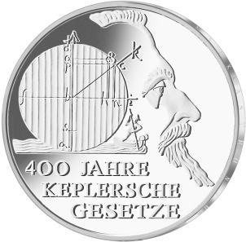
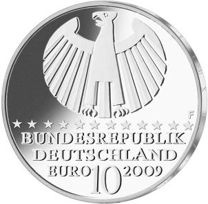

# Bekanntmachung über die Ausprägung von deutschen Euro-Gedenkmünzen im Nennwert von 10 Euro Gedenkmünze „400 Jahre Keplersche Gesetze“ (Münz10EuroBek 2009-03-24)

Ausfertigungsdatum
:   2009-03-24

Fundstelle
:   BGBl I: 2009, 739

## (XXXX)

Gemäß den §§ 2, 4, und 5 des Münzgesetzes vom 16. Dezember 1999 (BGBl.
I S. 2402) hat die Bundesregierung beschlossen, eine 10-Euro-
Gedenkmünze „400 Jahre Keplersche Gesetze“ prägen zu lassen. Die
Auflage der Münze beträgt 1 843 000 Stück, darunter maximal 200 000
Stück in Spiegelglanzausführung. Die Prägung erfolgt durch die
Staatlichen Münzen Baden-Württemberg, Prägestätte Stuttgart.

Die Münze wird ab dem 7. Mai 2009 in den Verkehr gebracht. Sie besteht
aus einer Legierung von 925 Tausendteilen Silber und 75 Tausendteilen
Kupfer, hat einen Durchmesser von 32,5 Millimetern und eine Masse von
18 Gramm. Das Gepräge auf beiden Seiten ist erhaben und wird von einem
schützenden, glatten Randstab umgeben.

Auf der Bildseite ist es hervorragend gelungen, nur die markanten Züge
des Profils von Kepler zu zeigen und in enger Verbindung dahinter
mathematisch-physikalische Ableitungen bildhaft einzuschreiben. Die
geometrische Figur, die zur Demonstration der astronomischen
Verhältnisse der Planetenbahn dient, ist wie die kleine Abbildung des
vorwärts bewegten Kahnes eine allegorische Darstellung der
Radialkraft, aus dem vor 400 Jahren veröffentlichten Werk „Astronomia
Nova“ (Prag 1609) entnommen.

Die Wertseite zeigt einen Adler, den Schriftzug „BUNDESREPUBLIK
DEUTSCHLAND“, die zwölf Europa-Sterne, die Wertziffer mit der Euro-
Bezeichnung sowie die Jahreszahl 2009 und das Münzzeichen „F“ der
Staatlichen Münzen Baden-Württemberg, Prägestätte Stuttgart.

Der glatte Münzrand enthält in vertiefter Prägung die Inschrift:

„ASTRONOMIA NOVA -
WENDE ZUR HIMMELSMECHANIK \* “.

Der Entwurf der Münze stammt von Herrn Prof. Ulrich Böhme, Stuttgart.

## Schlussformel

Der Bundesminister der Finanzen

## (XXXX)

(Fundstelle: BGBl. I 2009, 739)

*    *        
    *        

