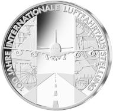

# Bekanntmachung über die Ausprägung von deutschen Euro-Gedenkmünzen im Nennwert von 10 Euro (Gedenkmünze „100 Jahre Internationale Luftfahrtausstellung“) (Münz10EuroBek 2009-05-07)

Ausfertigungsdatum
:   2009-05-07

Fundstelle
:   BGBl I: 2009, 1140

## (XXXX)

Gemäß den §§ 2, 4 und 5 des Münzgesetzes vom 16. Dezember 1999 (BGBl.
I S. 2402) hat die Bundesregierung beschlossen, aus Anlass des
100-jährigen Jubiläums der Internationalen Luftfahrtausstellung im
Jahr 2009 eine deutsche Euro-Gedenkmünze im Nennwert von 10 Euro
prägen zu lassen. Die Auflage der Münze beträgt 1 850 000 Stück,
darunter maximal
200 000              Stück in Spiegelglanzausführung. Die Prägung
erfolgt durch das Bayerische Hauptmünzamt, München.

Die Münze wird ab dem 4. Juni 2009 in den Verkehr gebracht. Sie
besteht aus einer Legierung von 925 Tausendteilen Silber und 75
Tausendteilen Kupfer, hat einen Durchmesser von 32,5 Millimetern und
eine Masse von 18 Gramm. Das Gepräge auf beiden Seiten ist erhaben und
wird von einem schützenden, glatten Randstab umgeben.

Die Bildseite der Münze zeigt im Mittelteil die Frontalansicht eines
modernen Flugzeugs beim Landeanflug. In beiden Seitenstreifen wird in
zurückhaltender, fast ornamentaler Gestaltung die Vielfalt der Luft-
und Raumfahrt – von den Fluggeräten Otto Lilienthals bis hin zur
Internationalen Raumstation ISS – deutlich.

Die Wertseite zeigt einen Adler, den Schriftzug „BUNDESREPUBLIK
DEUTSCHLAND“, die zwölf Europasterne, die Wertziffer und
Wertbezeichnung sowie die Jahreszahl 2009 und das Prägezeichen „D“ des
Bayerischen Hauptmünzamtes, München.

Der glatte Münzrand enthält in vertiefter Prägung die Inschrift:

„FASZINATION FLIEGEN \*
TRADITION \* INNOVATION \* “.

Der Entwurf stammt von Herrn Bodo Broschat, Berlin.

## Schlussformel

Der Bundesminister der Finanzen

## (XXXX)

(Fundstelle: BGBl. I 2009, 1140)

*    *        
    *        

*    *
    *

