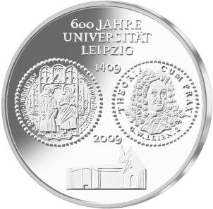
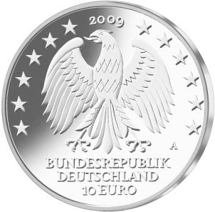

# Bekanntmachung über die Ausprägung von deutschen Euro-Gedenkmünzen im Nennwert von 10 Euro (Gedenkmünze „600 Jahre Universität Leipzig“) (Münz10EuroBek 2009-05-29)

Ausfertigungsdatum
:   2009-05-29

Fundstelle
:   BGBl I: 2009, 1278

## (XXXX)

Gemäß den §§ 2, 4 und 5 des Münzgesetzes vom 16. Dezember 1999 (BGBl.
I S. 2402) hat die Bundesregierung beschlossen, zum Thema „600 Jahre
Universität Leipzig“ eine deutsche Euro-Gedenkmünze im Nennwert von 10
Euro prägen zu lassen. Die Auflage der Münze beträgt 1 813 000 Stück,
darunter maximal 200 000 Stück in Spiegelglanzausführung. Die Prägung
erfolgt durch die Staatliche Münze Berlin.
Die Münze wird ab dem 9. Juli 2009 in den Verkehr gebracht. Sie
besteht aus einer Legierung von 925 Tausendteilen Silber und 75
Tausendteilen Kupfer, hat einen Durchmesser von 32,5 Millimetern und
eine Masse von 18 Gramm. Das Gepräge auf beiden Seiten ist erhaben und
wird von einem schützenden, glatten Randstab umgeben.
Im Mittelpunkt der Bildseite der Münze stehen die sechs Jahrhunderte
Geschichte der Universität Leipzig. Diese wird dargestellt durch das
Siegel der Universität mit den Heiligen Laurentius, dem Heiligen der
Studierenden, und Johannes dem Täufer sowie dem Bildnis des Gottfried
Wilhelm Leibniz, einem Studenten und Lehrer an der Universität. Der
Leitsatz dieses Universalgelehrten Leibniz „THEORIA CUM PRAXI“ ist für
die Universität auch heute noch zeitgemäß. Das dritte Bildelement
zeigt den Neubau der Universität, der als architektonisches Zitat an
die 1968 gesprengte Universitätskirche St. Pauli erinnert und das neue
Antlitz der Universität zeigt. Mit der Aufschrift wird auf die „600
Jahre Universität Leipzig“ und die Zeitspanne „1409 – 2009“
hingewiesen.
Die Wertseite zeigt einen Adler, den Schriftzug „BUNDESREPUBLIK
DEUTSCHLAND“, die Wertziffer und Wertbezeichnung, die Jahreszahl 2009
sowie das Prägezeichen „A“ der Staatlichen Münze Berlin.
Der glatte Münzrand enthält in vertiefter Prägung die Inschrift:
„AUS TRADITION GRENZEN ÜBERSCHREITEN“.
Der Entwurf stammt von Herrn Dietrich Dorfstecher, Berlin.

## Schlussformel

Der Bundesminister der Finanzen

## (XXXX)

(Fundstelle: BGBl. I 2009, 1278)

*    *        
    *        

