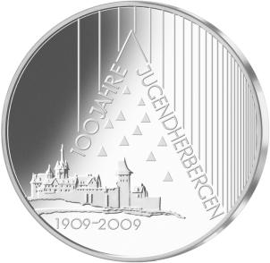
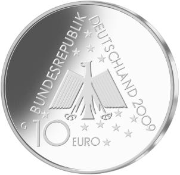

# Bekanntmachung über die Ausprägung von deutschen Euro-Gedenkmünzen im Nennwert von 10 Euro (Gedenkmünze „100 Jahre Jugendherbergen") (Münz10EuroBek 2009-07-27)

Ausfertigungsdatum
:   2009-07-27

Fundstelle
:   BGBl I: 2009, 2443

## (XXXX)

Gemäß den §§ 2, 4 und 5 des Münzgesetzes vom 16. Dezember 1999 (BGBl.
I S. 2402) hat die Bundesregierung beschlossen, zum 100-jährigen
Jubiläum der Jugendherbergen im Jahr 2009 eine deutsche Euro-
Gedenkmünze im Nennwert von 10 Euro prägen zu lassen.

Die Auflage der Münze beträgt 1 810 000 Stück, darunter maximal
200 000 Stück in Spiegelglanzausführung. Die Prägung erfolgt durch die
Staatlichen Münzen Baden-Württemberg, Prägestätte Karlsruhe.

Die Münze wird ab dem 13. August 2009 in den Verkehr gebracht. Sie
besteht aus einer Legierung von 925 Tausendteilen Silber und 75
Tausendteilen Kupfer, hat einen Durchmesser von 32,5 Millimetern und
eine Masse von 18 Gramm. Das Gepräge auf beiden Seiten ist erhaben und
wird von einem schützenden, glatten Randstab umgeben.

Die Bildseite besticht durch ihre moderne Gestaltung, die das heutige
Selbstverständnis des Deutschen Jugendherbergswerks (DJH) spiegelt.
Sie zeigt die erste dauerhafte Jugendherberge, Altena in Westfalen,
als Ausgangspunkt der weltweiten Verbreitung. Die gleitend abnehmenden
Abstände der senkrechten Linien drücken Wandel und Dynamik des
Jugendherbergswesens aus.

Die Wertseite zeigt einen Adler, den Schriftzug „BUNDESREPUBLIK
DEUTSCHLAND“, die zwölf Europasterne, die Wertziffer und
Wertbezeichnung sowie die Jahreszahl 2009 und das Prägezeichen „G“ der
Staatlichen Münzen Baden-Württemberg, Prägestätte Karlsruhe.

Der glatte Münzrand enthält in vertiefter Prägung die Inschrift:

„BEGEGNUNG GEMEINSCHAFT TOLERANZ •“.

Der Entwurf stammt von Herrn Hans Joa Dobler aus Ehekirchen.

## Schlussformel

Der Bundesminister der Finanzen

## (XXXX)

*    *        
    *        

