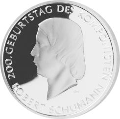
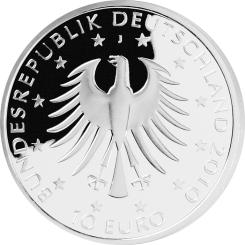

# Bekanntmachung über die Ausprägung von deutschen Euro-Gedenkmünzen im Nennwert von 10 Euro (Gedenkmünze „200. Geburtstag des Komponisten Robert Schumann“) (Münz10EuroBek 2010-04)

Ausfertigungsdatum
:   2010-04-15

Fundstelle
:   BGBl I: 2010, 449

## (XXXX)

Gemäß den §§ 2, 4 und 5 des Münzgesetzes vom 16. Dezember 1999 (BGBl.
I S. 2402) hat die Bundesregierung beschlossen, eine 10-Euro-
Gedenkmünze „200. Geburtstag des Komponisten Robert Schumann“ prägen
zu lassen.

Die Auflage der Münze beträgt maximal 1 900 000 Stück, darunter
maximal 200 000 Stück in Spiegelglanzausführung. Die Prägung erfolgt
durch die Hamburgische Münze.

Die Münze wird ab dem 6. Mai 2010 in den Verkehr gebracht. Sie besteht
aus einer Legierung von 925 Tausendteilen Silber und 75 Tausendteilen
Kupfer, hat einen Durchmesser von 32,5 Millimetern und eine Masse von
18 Gramm. Das Gepräge auf beiden Seiten ist erhaben und wird von einem
schützenden, glatten Randstab umgeben.

Die Bildseite zeigt ein Schumannbildnis, das schon zu Lebzeiten
Schumanns einen großen Bekanntheitsgrad hatte. Das vom Schumannfreund
Rietschel entworfene Reliefbildnis entstand 1846 in Dresden und zeigt
den 36-jährigen Schumann im Profil. Die zeitgemäße klare Schrift als
Umschrift steht in einem interessanten Kontrast zum klassischen
Portrait, das sich durch eine hohe Wiedererkennung Robert Schumanns
auszeichnet.

Die Wertseite zeigt einen gut proportionierten und grafisch kraftvoll
gestalteten Adler im Zentrum der Münze und bildet zusammen mit der
gleichmäßigen Anordnung der Umschrift „10 EURO BUNDESREPUBLIK
DEUTSCHLAND 2010“ und dem Münzzeichen „J“ über dem Adlerkopf ein
überzeugendes Pendant zur Bildseite.

Der glatte Münzrand enthält in vertiefter Prägung die Inschrift:

„TÖNE SIND HÖHERE WORTE
•             “

(eine Feststellung Schumanns, festgehalten in seinem Tagebuch von
1828).

Der Entwurf stammt von dem Künstler Professor Christian Höpfner,
Berlin.

## Schlussformel

Der Bundesminister der Finanzen

## (XXXX)

(Fundstelle: BGBl. I 2010, 449)

*    *        
    *
    *        

