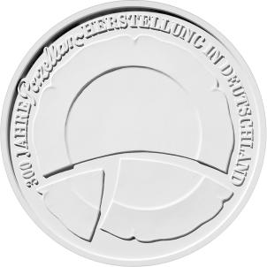
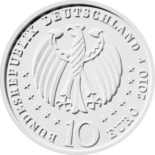

# Bekanntmachung über die Ausprägung von deutschen Euro-Gedenkmünzen im Nennwert von 10 Euro (Gedenkmünze „300 Jahre Porzellanherstellung in Deutschland“) (Münz10EuroBek 2010-05-10)

Ausfertigungsdatum
:   2010-05-10

Fundstelle
:   BGBl I: 2010, 653 (885) (2012 I 1362)

## (XXXX)

Gemäß den §§ 2, 4 und 5 des Münzgesetzes vom 16. Dezember 1999 (BGBl.
I S. 2402) hat die Bundesregierung beschlossen, zum Thema „300 Jahre
Porzellanherstellung in Deutschland“ eine deutsche Euro-Gedenkmünze im
Nennwert von 10 Euro prägen zu lassen.

Die Auflage der Münze beträgt 1 931 900 Stück, darunter 180 000 Stück
in Spiegelglanzausführung. Die Prägung erfolgt durch die Staatlichen
Münzen Baden-Württemberg.

Die Münze wird ab dem 8. Juli 2010 in den Verkehr gebracht. Sie
besteht aus einer Legierung von 925 Tausendteilen Silber und 75
Tausendteilen Kupfer, hat einen Durchmesser von 32,5 Millimetern und
eine Masse von 18 Gramm. Das Gepräge auf beiden Seiten ist erhaben und
wird von einem schützenden, glatten Randstab umgeben.

Die Bildseite der Münze erhält durch die sehr große Gestaltung des
Tellers eine monumentale Ausstrahlung. Der Künstler setzt sich mit dem
Thema Porzellan auf eine erfrischende und unkonventionelle Weise
auseinander. Gezeigt wird ein zerbrochener Teller, der einen Teil des
Wesens des Porzellans verkörpert: seine Zerbrechlichkeit.

Ähnlich der Bildseite wird auf der Wertseite der Adler harmonisch ins
Zentrum gestellt. Durch die Einfügung strenger ornamentaler Strukturen
erhält das Hoheitssymbol eine deutliche Plastizität.

Die Wertseite zeigt einen Adler, den Schriftzug „BUNDESREPUBLIK
DEUTSCHLAND“, die Wertziffer und Wertbezeichnung, die Jahreszahl 2010
sowie das Prägezeichen „F“ der Staatlichen Münzen Baden-Württemberg.

Der glatte Münzrand enthält in vertiefter Prägung die Inschrift:

„ZAUBER DER ZERBRECHLICHKEIT“.

Der Entwurf stammt von dem Künstler Ulrich Böhme aus Stuttgart.

## Schlussformel

Der Bundesminister der Finanzen

## (XXXX)

(Fundstelle: BGBl. 2010, 653)

*    *        
    *        

