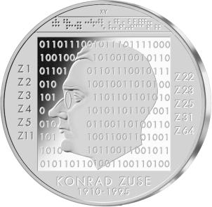
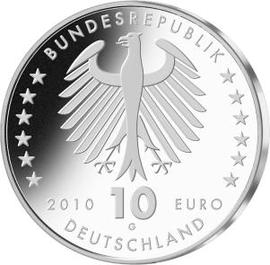

# Bekanntmachung über die Ausprägung von deutschen Euro-Gedenkmünzen im Nennwert von 10 Euro (Gedenkmünze „100. Geburtstag von Konrad Zuse“) (Münz10EuroBek 2010-05-20)

Ausfertigungsdatum
:   2010-05-20

Fundstelle
:   BGBl I: 2010, 687

## (XXXX)

Gemäß den §§ 2, 4 und 5 des Münzgesetzes vom 16. Dezember 1999 (BGBl.
I S. 2402) hat die Bundesregierung beschlossen, eine 10-Euro-
Gedenkmünze „100. Geburtstag von Konrad Zuse“ prägen zu lassen.

Die Auflage der Münze beträgt maximal 1 906 000 Stück, darunter
maximal 200 000 Stück in Spiegelglanzausführung. Die Prägung erfolgt
durch die Staatlichen Münzen Baden-Württemberg, Prägestätte Karlsruhe.

Die Münze wird ab dem 10. Juni 2010 in den Verkehr gebracht. Sie
besteht aus einer Legierung von 925 Tausendteilen Silber und 75
Tausendteilen Kupfer, hat einen Durchmesser von 32,5 Millimetern und
eine Masse von 18 Gramm. Das Gepräge auf beiden Seiten ist erhaben und
wird von einem schützenden, glatten Randstab umgeben.

Im Mittelpunkt der Bildseite steht ein Quadrat mit der
zukunftsweisenden binären Rechnersprache, teilweise überlagert durch
ein stilisiertes Profil Zuses. Diese Kombination wird, in Verbindung
mit dem im oberen Teil dargestellten Lochstreifen sowie den seitlich
abgebildeten Bezeichnungen der von Zuse gebauten Apparate Z 1 bis Z
64, seiner bis in die heutige Zeit reichenden Bedeutung in
überzeugender Weise gerecht.

Die Wertseite zeigt einen Adler, den Schriftzug „BUNDESREPUBLIK
DEUTSCHLAND“, die zwölf Europasterne, die Wertziffer und
Wertbezeichnung sowie die Jahreszahl 2010 und das Prägezeichen „G“ der
Staatlichen Münzen Baden-Württemberg, Prägestätte Karlsruhe.

Der glatte Münzrand enthält in vertiefter Prägung die Inschrift:

„KONRAD ZUSE -
VISIONÄR ZWISCHEN NULL UND EINS •“.

Der Entwurf stammt von dem Künstler Heinz Hoyer, Berlin.

## Schlussformel

Der Bundesminister der Finanzen

## (XXXX)

(Fundstelle: BGBl. I 2010, 687)

*    *        
    *        

