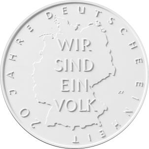
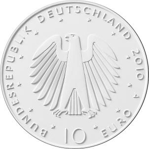

# Bekanntmachung über die Ausprägung von deutschen Euro-Gedenkmünzen im Nennwert von 10 Euro (Gedenkmünze „20 Jahre Deutsche Einheit“) (Münz10EuroBek 2010-08)

Ausfertigungsdatum
:   2010-08-13

Fundstelle
:   BGBl I: 2010, 1196

## (XXXX)

Gemäß den §§ 2, 4 und 5 des Münzgesetzes vom 16. Dezember 1999 (BGBl.
I S. 2402) hat die Bundesregierung beschlossen, zum Thema „20 Jahre
Deutsche Einheit“ eine deutsche Euro-Gedenkmünze im Nennwert von 10
Euro prägen zu lassen.

Die Auflage der Münze beträgt maximal 2 100 000 Stück in Normalprägung
und maximal 200 000 Stück in Spiegelglanzausführung. Die Prägung
erfolgt durch die Staatliche Münze Berlin.

Die Münze wird ab dem 2. September 2010 in den Verkehr gebracht. Sie
besteht aus einer Legierung von 925 Tausendteilen Silber und 75
Tausendteilen Kupfer, hat einen Durchmesser von 32,5 Millimetern und
eine Masse von 18 Gramm. Das Geprägte auf beiden Seiten ist erhaben
und wird von einem schützenden, glatten Randstab umgeben.

Die Bildseite der Münze besticht durch grafische und inhaltliche
Klarheit. Die zentrale Aussage „Wir sind ein Volk“ steht als Wille des
deutschen Volkes zur Einheit im Mittelpunkt.

Die Wertseite zeigt einen Adler, den Schriftzug „BUNDESREPUBLIK
DEUTSCHLAND“, die Wertziffer und Wertbezeichnung, die Jahreszahl 2010
sowie das Prägezeichen „A“ der Staatlichen Münze Berlin.

Der glatte Münzrand enthält in vertiefter Prägung die Inschrift:

„Einigkeit und Recht und Freiheit“.

Der Entwurf stammt vom Künstler Erich Ott aus München.

## Schlussformel

Der Bundesminister der Finanzen

## (XXXX)

*    *        
    *        

