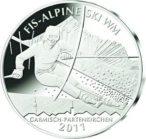
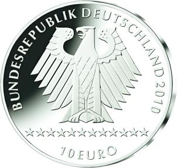

# Bekanntmachung über die Ausprägung von deutschen Euro-Gedenkmünzen im Nennwert von 10 Euro Gedenkmünze „FIS-ALPINE SKI WM 2011 Garmisch-Partenkirchen“ (Münz10EuroBek 2010-12-17)

Ausfertigungsdatum
:   2010-12-17

Fundstelle
:   BGBl I: 2010, 2330

## (XXXX)

Gemäß den §§ 2, 4 und 5 des Münzgesetzes vom 16. Dezember 1999 (BGBl.
I S. 2402) hat die Bundesregierung beschlossen, aus Anlass der FIS
ALPINE SKI-WM 2011 in Garmisch-Partenkirchen eine deutsche Euro-
Gedenkmünze im Nennwert von 10 Euro prägen zu lassen.

Die Auflage der Münze beträgt maximal 2 210 000 Stück, darunter
maximal 210 000 Stück in Spiegelglanzausführung. Die Prägung erfolgt
durch die fünf staatlichen deutschen Münzstätten in Berlin, München,
Stuttgart, Karlsruhe und Hamburg.

Die Münze wird seit dem 26. Oktober 2010 in den Verkehr gebracht. Sie
besteht aus einer Legierung von 925 Tausendteilen Silber und 75
Tausendteilen Kupfer, hat einen Durchmesser von 32,5 Millimetern und
eine Masse von 18 Gramm. Das Gepräge auf beiden Seiten ist erhaben und
wird von einem schützenden, glatten Randstab umgeben.

Die Bildseite bringt durch die Darstellung eines Slalomfahrers vor dem
Hintergrund der Alpspitze in überzeugender Weise die Verbindung von
Natur und Dynamik des alpinen Skisports zum Ausdruck. Zusammen mit der
im unteren Teil angedeuteten Silhouette von Garmisch-Partenkirchen,
dem Austragungsort der Weltmeisterschaft, ergibt sich ein
ansprechendes künstlerisches Gesamtbild.

Die Wertseite zeigt einen Adler, den Schriftzug „BUNDESREPUBLIK
DEUTSCHLAND“, die Wertziffer und Wertbezeichnung sowie die Jahreszahl
2010 und die zwölf Europasterne.

Der glatte Münzrand enthält in vertiefter Prägung die Inschrift:

„*              FESTSPIELE IM SCHNEE*             “

sowie die Prägebuchstaben „A D F G J“ der deutschen Prägestätten.

Der Entwurf stammt von dem Künstler Bodo Broschat, Berlin.

## Schlussformel

Der Bundesminister der Finanzen

## (XXXX)

(Fundstelle: BGBl. I 2010, 2330)

*    *        
    *        

