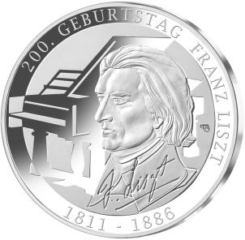
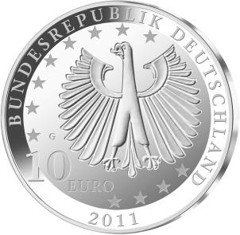

# Bekanntmachung über die Ausprägung von deutschen Euro-Gedenkmünzen im Nennwert von 10 Euro (Gedenkmünze „200. Geburtstag Franz Liszt“) (Münz10EuroBek 2011-01-20)

Ausfertigungsdatum
:   2011-01-20

Fundstelle
:   BGBl I: 2011, 62

## (XXXX)

Gemäß den §§ 2, 4 und 5 des Münzgesetzes vom 16. Dezember 1999 (BGBl.
I S. 2404) hat die Bundesregierung beschlossen, zum Thema „200.
Geburtstag Franz Liszt“ eine deutsche Euro-Gedenkmünze im Nennwert von
10 Euro prägen zu lassen.

Die Auflage der Münze beträgt 2 187 000 Stück in Normalprägung und
maximal 200 000 Stück in Spiegelglanzausführung. Die Prägung erfolgt
durch die Staatlichen Münzen Baden-Württemberg, Prägestätte Karlsruhe.

Die Münze wird ab dem 3. Februar 2011 in den Verkehr gebracht. Sie
besteht aus einer Legierung von 625 Tausendteilen Silber und 375
Tausendteilen Kupfer, hat einen Durchmesser von 32,5 Millimetern und
eine Masse von 16 Gramm. Das Geprägte auf beiden Seiten ist erhaben
und wird von einem schützenden, glatten Randstab umgeben.

Die Bildseite besticht durch den riskanten Kontrast zwischen dem
Gesichtsrelief und dem Schichtrelief des Flügels im Hintergrund. Der
Widerspruch ist formal gelungen und spiegelt das überaus
widerspruchsreiche Leben und Werk Franz Liszts.

Das Gesicht weist auf den unbändigen Gestaltungswillen des Komponisten
in der Nachfolge Beethovens hin. Es ist handwerklich fein und
nuancenreich modelliert und spricht von einem wachen und
willensstarken Charakter in der Mitte des Lebens.

Die Wertseite zeigt einen Adler, die Umschrift „BUNDESREPUBLIK
DEUTSCHLAND 2011“ mit den zwölf Europasternen und der Wertbezeichnung
„10 Euro“ sowie dem Münzzeichen „G“ der Staatlichen Münzen Baden-
Württemberg, Prägestätte Karlsruhe, links neben dem Adler.

Der glatte Münzrand enthält in vertiefter Prägung die Inschrift:

„GENIE OBLIGE - GENIE VERPFLICHTET •“.

Der Entwurf stammt von dem Künstler Michael Otto aus Rodenbach.

## Schlussformel

Der Bundesminister der Finanzen

## (XXXX)

(Fundstelle: BGBl. I 2011, 62)

*    *        
    *        

