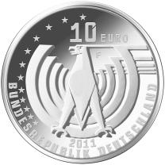
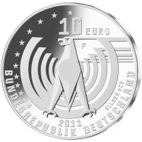

# Bekanntmachung über die Ausprägung von deutschen Euro-Gedenkmünzen im Nennwert von 10 Euro (Gedenkmünze „125 Jahre Automobil“) (Münz10EuroBek 2011-05-23)

Ausfertigungsdatum
:   2011-05-23

Fundstelle
:   BGBl I: 2011, 1006 (2012 I 1362)

## (XXXX)

Gemäß den §§ 2, 4 und 5 des Münzgesetzes vom 16. Dezember 1999 (BGBl.
I S. 2402) hat die Bundesregierung beschlossen, zum Thema „125 Jahre
Automobil“ eine deutsche Euro-Gedenkmünze im Nennwert von 10 Euro
prägen zu lassen.

Die Auflage der Münze beträgt 2 104 000 Stück, davon ca. 200 000 Stück
in der Spiegelglanzqualität. Die Prägung erfolgt durch die Staatlichen
Münzen Baden-Württemberg, Prägestätte Stuttgart.

Die Münze wird ab dem 9. Juni 2011 in den Verkehr gebracht. Die
10-Euro-Gedenkmünze in der Stempelglanzqualität besteht aus einer
Kupfer-Nickel-Legierung (CuNi25), hat einen Durchmesser von 32,5
Millimetern und ein Gewicht von 14 Gramm. Die Spiegelglanzmünze
besteht aus einer Legierung von 625 Tausendteilen Silber und 375
Tausendteilen Kupfer, hat einen Durchmesser von 32,5 Millimetern und
ein Gewicht von 16 Gramm. Die Spiegelglanzmünze ist durch den
Prägeaufdruck „Silber 625“ gekennzeichnet. Das Gepräge auf beiden
Seiten ist erhaben und wird von einem schützenden, glatten Randstab
umgeben.

Die aktive Fahrdarstellung des Lenkrads auf der Bildseite vermittelt
durch die Lust am Fahren ein aktives Lebensgefühl. Die Darstellung der
stilisierten Straße mit Bäumen verweist auf den Weg in die Zukunft,
die mit dem zunehmenden Bewusstsein für den Umweltgedanken verbunden
wird.

Wert- und Bildseite entsprechen sich in hervorragender Weise durch die
dynamische und moderne grafische Gestaltung, welche auf der Kreisform
des Lenkrads basiert. Der Adler hat eine kraftvolle und würdige
Anmutung. Besonders interessant ist die Ausformulierung der seitlichen
Schwingfedern, die bei Drehung der Münze das Euro-Symbol sichtbar
werden lässt.

Die Wertseite zeigt einen Adler, die Umschrift „BUNDESREPUBLIK
DEUTSCHLAND 2011“ mit den zwölf Europasternen, der Wertbezeichnung „10
Euro“ und dem Münzzeichen „F“ der Staatlichen Münzen Baden-
Württemberg, Prägestätte Stuttgart sowie den Prägeaufdruck „Silber
625“ auf der Wertseite der Münze in der Spiegelglanzqualität.

Der Münzrand enthält in vertiefter Prägung die Inschrift:

„WAS UNS BEWEGT“,

die durch eine Linie verbunden wird.

Der Entwurf stammt vom Künstler Jordi Truxa, Berlin.

## Schlussformel

Der Bundesminister der Finanzen

## (XXXX)

(Fundstelle: BGBl. I 2011, 1006)

*    *        
    *        

*    *        
    *        

