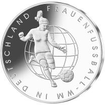
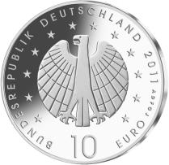
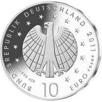

# Bekanntmachung über die Ausprägung von deutschen Euro-Gedenkmünzen im Nennwert von 10 Euro (Gedenkmünze „FRAUENFUSSBALL-WM in DEUTSCHLAND“) (Münz10EuroBek 2011-05-23/2)

Ausfertigungsdatum
:   2011-05-23

Fundstelle
:   BGBl I: 2011, 1007 (2012 I 1362)

## (XXXX)

Gemäß den §§ 2, 4 und 5 des Münzgesetzes vom 16. Dezember 1999 (BGBl.
I S. 2402) hat die Bundesregierung beschlossen, zum Thema
„FRAUENFUSSBALL-WM in DEUTSCHLAND“ eine deutsche Euro-Gedenkmünze im
Nennwert von 10 Euro prägen zu lassen.

Die Auflage der Münze beträgt 2 224 000 Stück, davon ca. 200 000 Stück
in der Spiegelglanzqualität. Die Prägung erfolgt durch die fünf
staatlichen deutschen Münzstätten in Berlin, München, Stuttgart,
Karlsruhe und Hamburg.

Die Münze wird ab dem 9. Juni 2011 in den Verkehr gebracht. Die
10-Euro-Gedenkmünze in der Stempelglanzqualität besteht aus einer
Kupfer-Nickel-Legierung (CuNi25), hat einen Durchmesser von 32,5
Millimetern und ein Gewicht von 14 Gramm. Die Spiegelglanzmünze
besteht aus einer Legierung von 625 Tausendteilen Silber und 375
Tausendteilen Kupfer, hat einen Durchmesser von 32,5 Millimetern und
ein Gewicht von 16 Gramm. Die Spiegelglanzmünze ist durch
Prägeaufdruck „Silber 625“ gekennzeichnet. Das Gepräge auf beiden
Seiten ist erhaben und wird von einem schützenden, glatten Randstab
umgeben.

Im Zentrum der Bildseite steht eine Fußballspielerin in einer
Spielsituation, die sowohl spielerische Eleganz, als auch Dynamik
ausstrahlt. Die gut herausgearbeitete Bewegung der Spielerin überzeugt
auch in der Detaillierung der Sportbekleidung. Die dezente Weltkugel
im Hintergrund ist eindeutiger Hinweis auf die Weltmeisterschaft und
ihre weltweite Bedeutung. Die Wertseite entspricht in ihren
Proportionen und der klaren grafischen Gestaltung gut der Bildseite.
Der Adler nimmt in seiner Form und der Gestaltung der Schwingen das
Motiv der Weltkugel wieder auf.

Die Wertseite zeigt einen Adler, die Umschrift „BUNDESREPUBLIK
DEUTSCHLAND 2011“ mit den zwölf Europasternen und der Wertbezeichnung
„10 Euro“ sowie die Prägebuchstaben „A D F G J“ der deutschen
Prägestätten und den Prägeaufdruck „Silber 625“ auf der Wertseite der
Münze in der Spiegelglanzqualität.

Der glatte Münzrand enthält in vertiefter Prägung die Inschrift:

„DIE ZUKUNFT DES FUSSBALLS IST WEIBLICH“.

Der Entwurf stammt von der Künstlerin Alina Hoyer, Berlin.

## Schlussformel

Der Bundesminister der Finanzen

## (XXXX)

(Fundstelle: BGBl. I 2011, 1007)

*    *        
    *        

*    *        
    *        

