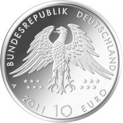
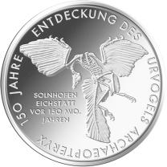
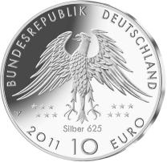

# Bekanntmachung über die Ausprägung von deutschen Euro-Gedenkmünzen im Nennwert von 10 Euro (Gedenkmünze „150 Jahre Entdeckung des Urvogels Archaeopteryx“) (Münz10EuroBek 2011-05-25)

Ausfertigungsdatum
:   2011-05-25

Fundstelle
:   BGBl I: 2011, 1008 (2012 I 1362)

## (XXXX)

Gemäß den §§ 2, 4 und 5 des Münzgesetzes vom 16. Dezember 1999 (BGBl.
I S. 2402) hat die Bundesregierung beschlossen, zum Thema „150 Jahre
Entdeckung des Urvogels Archaeopteryx“ eine deutsche Euro-Gedenkmünze
im Nennwert von 10 Euro prägen zu lassen.

Die Auflage der Münze beträgt 2 093 000 Stück, davon ca. 200 000 Stück
in der Spiegelglanzqualität. Die Prägung erfolgt durch die Staatliche
Münze Berlin.

Die Münze wird ab dem 11. August 2011 in den Verkehr gebracht. Die
10-Euro-Gedenkmünze in der Stempelglanzqualität besteht aus einer
Kupfer-Nickel-Legierung (CuNi25), hat einen Durchmesser von 32,5
Millimetern und ein Gewicht von 14 Gramm. Die Münze in der
Spiegelglanzqualität besteht aus einer Legierung von 625 Tausendteilen
Silber und 375 Tausendteilen Kupfer, hat einen Durchmesser von 32,5
Millimetern und ein Gewicht von 16 Gramm. Die Spiegelglanzmünze ist
durch Prägeaufdruck „Silber 625“ gekennzeichnet. Das Gepräge auf
beiden Seiten ist erhaben und wird von einem schützenden, glatten
Randstab umgeben.

Als Beispiel für den Archaeopteryx hat der Künstler das Exemplar des
Berliner Naturkundemuseums gewählt. Es ist ihm hervorragend gelungen,
das Besondere des Fossils darzustellen, nämlich die typische Mischung
der Merkmale, die den Charakter des Urvogels als Bindeglied zwischen
Dinosauriern und Vögeln dokumentieren. Archaeopteryx gilt deshalb auch
als eine Ikone der Evolutionsforschung. Die Hauptfundgebiete der
bisher entdeckten zehn Skelettexemplare und einer Einzelfeder liegen
in der Gegend von Solnhofen und Eichstädt in Bayern. Die
Fundschichten, die Solnhofener Plattenkalke, haben ein geologisches
Alter von 150 Millionen Jahren.

Die Wertseite entspricht in ihrer kompositorischen und künstlerischen
Eleganz der Bildseite. Die Klarheit der Schrift steht in einem
spannungsvollen Kontrast zur Lebendigkeit des Federkleides des Adlers.

Die Wertseite zeigt einen Adler, die Umschrift „BUNDESREPUBLIK
DEUTSCHLAND 2011“ mit den zwölf Europasternen, der Wertbezeichnung
„10 Euro“              und dem Münzzeichen „A“ der Staatlichen Münze
Berlin sowie den Prägeaufdruck „Silber 625“ auf der Wertseite der
Münze in der Spiegelglanzqualität.

Der Münzrand enthält in vertiefter Prägung die Inschrift:

„*              ARCHAEOPTERYX – ZEUGE DER EVOLUTION*             “.

Der Entwurf stammt von der Künstlerin Barbara G. Ruppel, Krailling.

## Schlussformel

Der Bundesminister der Finanzen

## (XXXX)

(Fundstelle: BGBl. I 2011, 1008)

*    *        
    *        

*    *        
    *        

