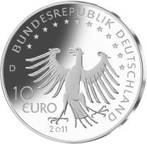
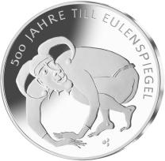

# Bekanntmachung über die Ausprägung von deutschen Euro-Gedenkmünzen im Nennwert von 10 Euro (Gedenkmünze „500 Jahre Till Eulenspiegel“) (Münz10EuroBek 2011-06-23)

Ausfertigungsdatum
:   2011-06-23

Fundstelle
:   BGBl I: 2011, 1262

## (XXXX)

Gemäß den §§ 2, 4 und 5 des Münzgesetzes vom 16. Dezember 1999 (BGBl.
I S. 2402) hat die Bundesregierung beschlossen, zum Thema „500 Jahre
Till Eulenspiegel“ eine deutsche Euro-Gedenkmünze im Nennwert von 10
Euro prägen zu lassen.

Die Auflage der Münze beträgt ca. 2 000 000 Stück, davon ca. 200 000
Stück in Spiegelglanzqualität. Die Prägung erfolgt durch das
Bayerische Hauptmünzamt, München.

Die Münze wird ab dem 14. Juli 2011 in den Verkehr gebracht. Die
10-Euro-Gedenkmünze in der Stempelglanzqualität besteht aus einer
Kupfer-Nickel-Legierung (CuNi25), hat einen Durchmesser von 32,5
Millimetern und ein Gewicht von 14 Gramm. Die Spiegelglanzmünze
besteht aus einer Legierung von 625 Tausendteilen Silber und 375
Tausendteilen Kupfer, hat einen Durchmesser von 32,5 Millimetern und
ein Gewicht von 16 Gramm. Die Spiegelglanzmünze ist durch den
Prägeaufdruck „Silber 625“ gekennzeichnet. Das Gepräge auf beiden
Seiten ist erhaben und wird von einem schützenden, glatten Randstab
umgeben.

Im Mittelpunkt der Bildseite steht eine asymmetrisch angeordnete
Eulenspiegel-Darstellung, die dessen ambivalenten Charakter, der die
gesamte Bandbreite zwischen Bösewicht und Schelm abdeckt, überzeugend
zum Ausdruck bringt.

Die Wertseite zeigt eine mit der Bildseite harmonierende
Adlerdarstellung, den Schriftzug „BUNDESREPUBLIK DEUTSCHLAND“,
Wertziffer und Wertbezeichnung, das Prägezeichen „D“, die Jahreszahl
2011 sowie die zwölf Europasterne. Die Wertseite der Münze in
Spiegelglanzqualität trägt ferner den Prägeaufdruck „Silber 625“.

Der glatte Münzrand enthält in vertiefter Prägung die Inschrift:

„SO BIN ICH DOCH HIE GEWESEN •“.

Der Entwurf stammt vom Künstler Friedrich Brenner, Diedorf.

## Schlussformel

Der Bundesminister der Finanzen

## (XXXX)

(Fundstelle: BGBl. I 2011, 1262)

*    *        
    *        

*    *        
    *        

