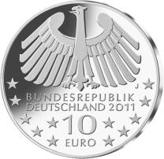
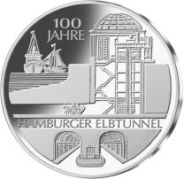
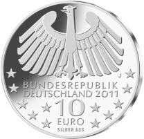

# Bekanntmachung über die Ausprägung von deutschen Euro-Gedenkmünzen im Nennwert von 10 Euro (Gedenkmünze „100 Jahre Hamburger Elbtunnel“) (Münz10EuroBek 2011-09-20)

Ausfertigungsdatum
:   2011-09-20

Fundstelle
:   BGBl I: 2011, 2061

## (XXXX)

Gemäß den §§ 2, 4 und 5 des Münzgesetzes vom 16. Dezember 1999 (BGBl.
I S. 2402) hat die Bundesregierung beschlossen, zum Thema „100 Jahre
Hamburger Elbtunnel“ eine deutsche Euro-Gedenkmünze im Nennwert von 10
Euro prägen zu lassen.

Die Auflage der Münze beträgt ca. 2 200 000 Stück, davon ca. 300 000
Stück in Spiegelglanzqualität. Die Prägung erfolgt durch die
Hamburgische Münze (Prägezeichen J).

Die Münze wird ab dem 15. September 2011 in den Verkehr gebracht. Die
10-Euro-Gedenkmünze in der Stempelglanzqualität besteht aus einer
Kupfer-Nickel-Legierung (CuNi25), hat einen Durchmesser von 32,5
Millimetern und ein Gewicht von 14 Gramm. Die Spiegelglanzmünze
besteht aus einer Legierung von 625 Tausendteilen Silber und 375
Tausendteilen Kupfer, hat einen Durchmesser von 32,5 Millimetern und
ein Gewicht von 16 Gramm. Die Spiegelglanzmünze ist durch den
Prägeaufdruck „SILBER 625“ gekennzeichnet. Das Gepräge auf beiden
Seiten ist erhaben und wird von einem schützenden, glatten Randstab
umgeben.

Die Bildseite zeigt eine vollständige Darstellung des Hamburger
Elbtunnels, das heißt das Schachtbauwerk mit Tunnelanschluss, beide
Tunnelröhren sowie die laufende Schifffahrt.

Die Wertseite zeigt eine Adlerdarstellung, den Schriftzug
„BUNDESREPUBLIK DEUTSCHLAND“, Wertziffer und Wertbezeichnung, das
Prägezeichen „J“, die Jahreszahl 2011 sowie die zwölf Europasterne.
Die Wertseite der Münze in Spiegelglanzqualität trägt ferner den
Prägeaufdruck „SILBER 625“.

Der glatte Münzrand enthält in vertiefter Prägung die Inschrift:

„VERBINDUNG VON STADT UND HAFEN*             “.

Der Entwurf stammt vom Künstler Herwig Otto, Rodenbach.

## Schlussformel

Der Bundesminister der Finanzen

## (XXXX)

(Fundstelle: BGBl. I 2011, 2061)

*    *        
    *        

*    *        
    *        

