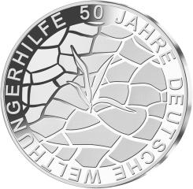
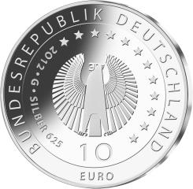

# Bekanntmachung über die Ausprägung von deutschen Euro-Gedenkmünzen im Nennwert von 10 Euro (Gedenkmünze „50 Jahre Deutsche Welthungerhilfe“) (Münz10EuroBek 2012-02-13)

Ausfertigungsdatum
:   2012-02-13

Fundstelle
:   BGBl I: 2012, 385

## (XXXX)

Gemäß den §§ 2, 4 und 5 des Münzgesetzes vom 16. Dezember 1999 (BGBl.
I S. 2404) hat die Bundesregierung beschlossen, zum Thema „50 Jahre
Deutsche Welthungerhilfe“ eine deutsche Euro-Gedenkmünze im Nennwert
von 10 Euro prägen zu lassen.

Die Auflage der Münze beträgt ca. 2 000 000 Stück, davon ca. 250 000
Stück in der Spiegelglanzqualität. Die Prägung erfolgt durch die
Staatlichen Münzen Baden-Württemberg, Prägestätte Karlsruhe (G).

Die Münze wird ab dem 12. April 2012 in den Verkehr gebracht. Die
10-Euro-Gedenkmünze in der Stempelglanzqualität besteht aus einer
Kupfer-Nickel-Legierung (CuNi25), hat einen Durchmesser von 32,5
Millimetern und eine Masse von 14 Gramm. Die Spiegelglanzmünze besteht
aus einer Legierung von 625 Tausendteilen Silber und 375 Tausendteilen
Kupfer, hat einen Durchmesser von 32,5 Millimetern und ein Gewicht von
16 Gramm. Das Gepräge auf beiden Seiten ist erhaben und wird von einem
schützenden, glatten Randstab umgeben.

Die Bildseite zeigt ausgetrockneten Boden, der Hunger und Armut
symbolisiert.

Die Wertseite der Gedenkmünze zeigt einen Adler, die Umschrift
„BUNDESREPUBLIK DEUTSCHLAND 2012“ mit den zwölf Europasternen und der
Wertbezeichnung „10 Euro“ sowie dem Münzzeichen „G“ der Staatlichen
Münzen Baden-Württemberg, Prägestätte Karlsruhe, links neben dem
Adler. Auf der Wertseite der Münze in Spiegelglanzqualität ist
zusätzlich die Angabe „SILBER 625“ aufgeprägt.

Der glatte Münzrand enthält in vertiefter Prägung die Inschrift:

„\*HILFE ZUR SELBSTHILFE\*“.

Der Entwurf der Münze stammt von der Künstlerin Elena Gerber aus
Berlin.

## Schlussformel

Der Bundesminister der Finanzen

## (XXXX)

(Fundstelle: BGBl. I 2012, 385)

*    *        
    *        

*    *        
    *        

